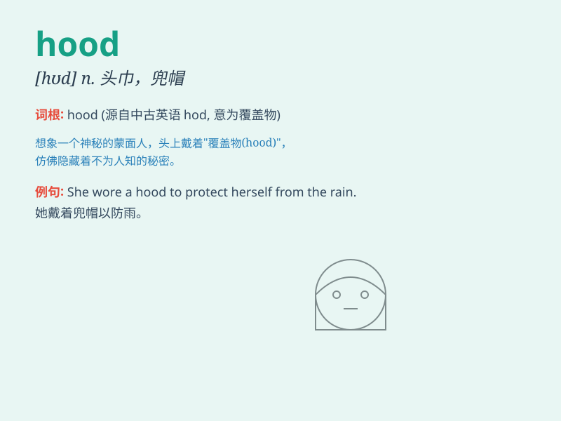

## hood

**英音:** _[hʊd]_ **美音:** _[hʊd]_

**译义:** *n.头巾,兜帽,车蓬,引擎罩v.用头巾包裹,给\...加罩,覆盖*

### 短语

+ **hood ornament:** _引擎盖装饰物_

+ **hood scoop:** _发动机罩进气口_

+ **hood latch:** _引擎盖锁扣_

+ **hooded sweatshirt:** _连帽运动衫_

+ **hooded crow:** _冠鸦_

### 例句

#### 例句1

> **He wore a hood to keep his face warm.**

**中文翻译:** 他戴着兜帽来保暖脸部。

**单词释义:** 兜帽；风帽

#### 例句2

> **The car\'s hood was dented in the accident.**

**中文翻译:** 这辆车的引擎盖在事故中凹陷了。

**单词释义:** （汽车的）引擎盖

#### 例句3

> **The robber pulled his hood over his face to hide his
identity.**

**中文翻译:** 强盗把他的兜帽拉过脸来隐藏身份。

**单词释义:** 兜帽；头巾

### 背诵小故事

> One day, a little boy put on a hood to protect himself from the rain.
But the wind blew the hood off. He had to chase it. Finally, he caught
the hood and was happy.

**一天，一个小男孩戴上兜帽来防雨。但风把兜帽吹掉了。他不得不去追。最后，他抓住了兜帽，很开心。**

### 图义

