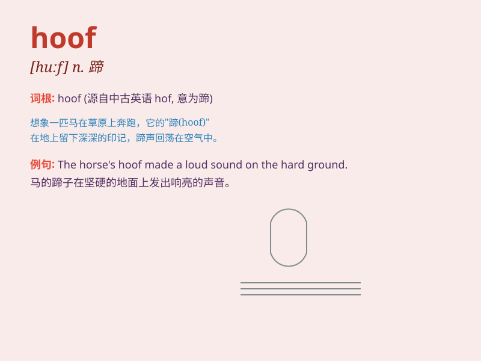

## hoof

**英音:** _[huːf]_ **美音:** _[huf]_

**译义:** *n.蹄v.踢*

### 短语

+ **hoof it:** _步行；徒步走_

+ **on the hoof:** _活的；未屠宰的；在活动中的_

+ **hoof mark:** _蹄印_

+ **hoof disease:** _蹄病_

+ **hoof care:** _蹄部护理_

### 例句

#### 例句1

> **The horse lifted its hoof and neighed.**

**中文翻译:** 这匹马抬起蹄子嘶叫。

**单词释义:** 蹄子

#### 例句2

> **He accidentally stepped on my hoof.**

**中文翻译:** 他不小心踩到了我的脚。

**单词释义:** 脚（非正式）

#### 例句3

> **The cow\'s hooves left deep prints in the mud.**

**中文翻译:** 这头牛的蹄子在泥里留下了深深的印记。

**单词释义:** 蹄子

### 背诵小故事

> One day, a horse was running happily. Its strong hooves hit the
ground powerfully. When it stopped, I noticed the hard and shiny hooves.
They were like special tools that helped the horse move fast and
steadily.

**一天，一匹马欢快地奔跑着。它强壮的蹄子有力地撞击着地面。当它停下来时，我注意到了那坚硬而闪亮的蹄子。它们就像特殊的工具，帮助马快速且平稳地移动。**

### 图义

