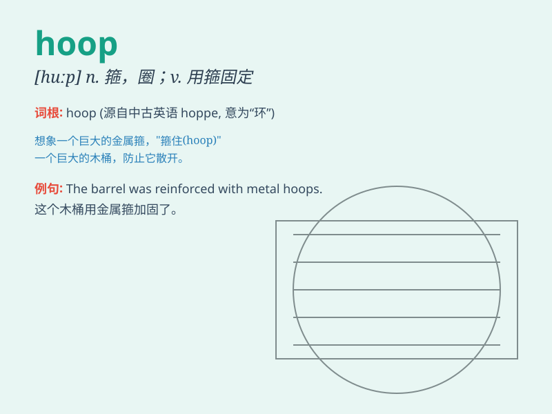

## hoop

**英音:** _[huːp]_ **美音:** _[hup]_

**译义:** *n.箍,铁环,戒指,篮v.加箍于,环绕*

### 短语

+ **hoop stress:** _环向应力；箍应力_

+ **hoop skirt:** _有箍衬裙_

+ **hula hoop:** _呼啦圈_

+ **shoot hoops:** _投篮；打篮球_

+ **metal hoop:** _金属环_

### 例句

#### 例句1

> **The basketball rolled through the hoop easily.**

**中文翻译:** 篮球很容易地穿过了篮圈。

**单词释义:** （篮球的）篮圈

#### 例句2

> **She wore a hoop skirt to the party.**

**中文翻译:** 她穿着一条有圈环裙撑的裙子去参加聚会。

**单词释义:** 圈环；裙撑

#### 例句3

> **The children were jumping through hoops in the playground.**

**中文翻译:** 孩子们在操场上跳圈。

**单词释义:** 圈；环

### 背诵小故事

> A little monkey wanted to jump through the hoop. It practiced many
times but failed. Finally, with perseverance, it successfully jumped
through the hoop and felt extremely happy.

**一只小猴子想要跳过铁环。它练习了很多次都失败了。最后，凭借着毅力，它成功跳过了铁环，感到非常开心。**

### 图义

