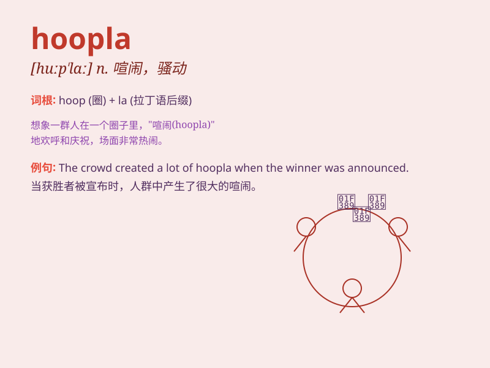

## hoopla

**英音:** _[\'huːplɑː]_ **美音:** _[\'huplɑ]_

**译义:** *n.喧闹,投环套物游戏*

### 短语

+ **make a hoopla:** _引起喧闹；大吵大闹_

+ **all the hoopla:** _所有的喧闹；全部的喧嚣_

+ **amid the hoopla:** _在喧闹之中_

+ **hoopla and commotion:** _喧闹和骚动_

+ **ignore the hoopla:** _不理会喧闹_

### 例句

#### 例句1

> **The new product launch was accompanied by a lot of hoopla.**

**中文翻译:** 新产品的发布伴随着大量的喧嚣。

**单词释义:** 喧嚣；大吹大擂

#### 例句2

> **Don\'t get caught up in the hoopla of the sales event.**

**中文翻译:** 不要陷入销售活动的喧嚣之中。

**单词释义:** 喧闹；热闹

#### 例句3

> **The hoopla around the celebrity\'s visit caused traffic
chaos.**

**中文翻译:** 这位名人来访引起的喧闹导致了交通混乱。

**单词释义:** 轰动；喧哗

### 背诵小故事

> A circus came to town. There was a lot of hoopla - colorful tents,
excited people, and lively music. The hoopla made the whole place feel
magical and fun. It was a big celebration!

**一个马戏团来到了镇上。这里有很多喧闹欢腾------五颜六色的帐篷、兴奋的人们和欢快的音乐。这种喧闹欢腾让整个地方都感觉神奇又有趣。这是一场盛大的庆祝！**

### 图义

