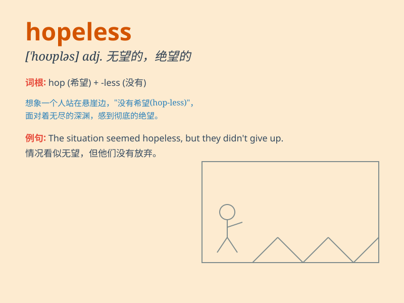

## hopeless

**英音:** _[\'həʊpləs]_ **美音:** _[ˈhoʊpləs]_

**译义:** *adj.没有希望的,绝望的,不可救药*

### 短语

+ **hopeless situation:** _绝望的处境_

+ **hopeless case:** _无可救药的情况_

+ **hopeless romantic:** _无可救药的浪漫主义者_

+ **feel hopeless:** _感到绝望_

+ **hopeless future:** _没有希望的未来_

### 例句

#### 例句1

> **He felt hopeless after failing the exam for the third time.**

**中文翻译:** 他在第三次考试不及格后感到绝望。

**单词释义:** 绝望的

#### 例句2

> **The situation seemed hopeless, but they didn\'t give up.**

**中文翻译:** 情况看起来毫无希望，但他们没有放弃。

**单词释义:** 没有希望的

#### 例句3

> **I\'m hopeless at math. I just can\'t understand it.**

**中文翻译:** 我数学很差。我就是搞不懂。

**单词释义:** 不行的，无能的

### 背诵小故事

> A young man was constantly failing in his job hunting. Every
interview ended in disappointment. He felt hopeless, as if there was no
way out. But then he decided to learn new skills and finally found a
good job.

**一个年轻人在求职中不断失败。每次面试都以失望告终。他感到绝望，似乎毫无出路。但后来他决定学习新技能，最终找到了一份好工作。**

### 图义

