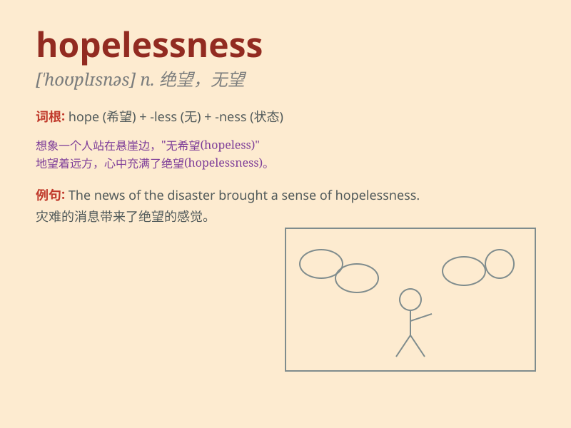

## hopelessness

**英音:** _[ˌhəʊpˈlɪs.nəs]_ **美音:** _[ˌhopˈlɪs.nəs]_

**译义:** *n.绝望，无希望的状态；无力感*

### 短语

+ **sense of hopelessness:** _绝望感_

+ **despair and hopelessness:** _绝望和无望_

+ **overcome hopelessness:** _克服无望_

+ **fall into hopelessness:** _陷入绝望_

+ **hopelessness of the situation:** _局势的无望_

### 例句

#### 例句1

> **The constant failures led him to a state of hopelessness.**

**中文翻译:** 不断的失败使他陷入了绝望的状态。

**单词释义:** 绝望

#### 例句2

> **She was overcome by hopelessness after losing her job.**

**中文翻译:** 她失业后被绝望情绪所笼罩。

**单词释义:** 绝望；无望

#### 例句3

> **The news filled him with a sense of hopelessness.**

**中文翻译:** 这个消息让他充满了绝望感。

**单词释义:** 绝望；无望

### 背诵小故事

> A man lost his job and faced many failures. He felt a deep sense of
hopelessness. Every attempt to change his situation seemed futile. But
then he found a glimmer of hope and overcame it.

**一个男人丢了工作，遭遇很多失败。他感到深深的绝望。每一次试图改变状况似乎都徒劳。但后来他找到了一线希望并克服了绝望。**

### 图义

