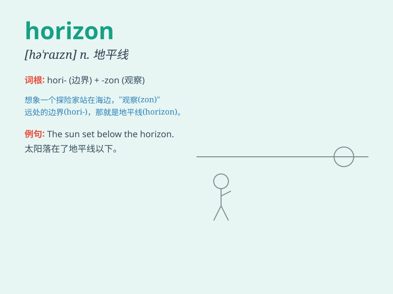

## horizon

**英音:** _[hə\'raɪz(ə)n]_ **美音:** _[hə\'raɪzn]_

**译义:** *n.地平线n.地平(线),(知识,思想等的)范围,视野*

### 短语

+ **on the horizon:** _即将发生；已露端倪_

+ **broaden one\'s horizons:** _开阔眼界_

+ **beyond the horizon:** _在视野之外；遥远的_

+ **horizontal horizon:** _水平地平线_

+ **new horizons:** _新的视野；新的前景_

### 例句

#### 例句1

> **The sun rose above the horizon.**

**中文翻译:** 太阳从地平线上升起。

**单词释义:** 地平线

#### 例句2

> **His horizons have expanded since he started traveling.**

**中文翻译:** 自从他开始旅行，他的视野开阔了。

**单词释义:** 视野；眼界

#### 例句3

> **The event opened up new horizons in medical research.**

**中文翻译:** 这次事件为医学研究开辟了新的前景。

**单词释义:** 前景；范围

### 背诵小故事

>
想象一下，你站在海边，极目远眺。那海天相接的地方就是\'horizon\'。你渴望走向那里，去探索未知。这个遥远的边界，就像你的梦想，看似遥远，但只要努力就能抵达。

**想象你站在海边，看到的海天相接处就是"地平线"这个单词所指的意思。你渴望走向那里，就像渴望实现梦想，虽远但可及。**

### 图义

