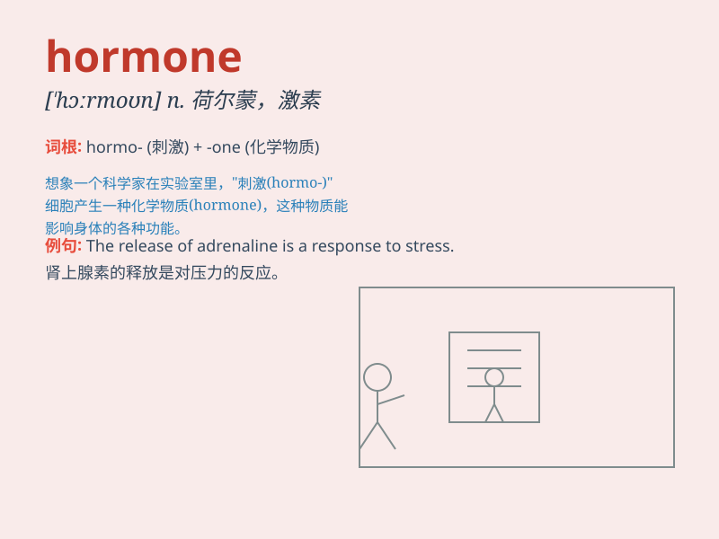

## hormone

**英音:** _[\'hɔːməʊn]_ **美音:** _[\'hɔrmon]_

**译义:** *n.荷尔蒙,激素*

### 短语

+ **sex hormone:** _性激素_

+ **growth hormone:** _生长激素_

+ **hormone imbalance:** _激素失衡_

+ **hormone replacement therapy:** _激素替代疗法_

+ **endocrine hormone:** _内分泌激素_

### 例句

#### 例句1

> **The body\'s hormones play a crucial role in regulating growth and
metabolism.**

**中文翻译:** 身体的激素在调节生长和新陈代谢方面起着关键作用。

**单词释义:** 激素

#### 例句2

> **Hormone imbalance can lead to various health problems.**

**中文翻译:** 激素失衡会导致各种健康问题。

**单词释义:** 激素

#### 例句3

> **The doctor is testing her hormone levels to determine the cause
of her symptoms.**

**中文翻译:** 医生正在检测她的激素水平以确定她症状的原因。

**单词释义:** 激素

### 背诵小故事

> A little scientist was always curious about how people grow. One day,
he discovered a magic substance called \'hormone\' that secretly
controls our body\'s changes and growth. It\'s like a hidden key that
unlocks our development!

**一位小科学家一直对人们如何成长感到好奇。有一天，他发现了一种神奇的物质叫做'激素'，它悄悄地控制着我们身体的变化和成长。它就像一把隐藏的钥匙，开启了我们的发育！**

### 图义

