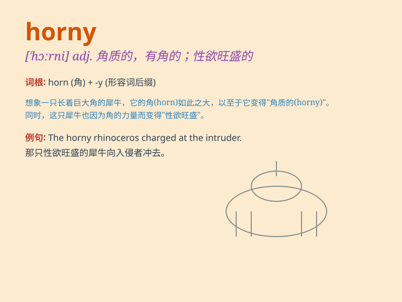

## horny

**英音:** _[\'hɔːnɪ]_ **美音:** _[\'hɔrni]_

**译义:** *adj.角状的*

### 短语

+ **horny hands:** _长满老茧的手_

+ **horny layer:** _角质层_

+ **horny beak:** _角质喙_

+ **horny texture:** _粗糙的质地_

+ **horny growth:** _角质增生_

### 例句

#### 例句1

> **The goat has horny horns.**

**中文翻译:** 这只山羊有角质的角。

**单词释义:** 角质的

#### 例句2

> **He gets horny when he sees a beautiful woman.**

**中文翻译:** 当他看到漂亮女人时就变得欲火中烧。

**单词释义:** 欲火中烧的；性兴奋的

#### 例句3

> **The horny Toad is a unique creature.**

**中文翻译:** 角蟾是一种独特的生物。

**单词释义:** 有角的

### 背诵小故事

> A goat was walking in the field. Its horns were sharp and it looked
very horny. It wanted to fight with others to show its strength. But
finally, it just found some grass to eat peacefully.

**一只山羊在田野里走着。它的角很锋利，看起来很欲求不满。它想和其他动物打架来展示自己的力量。但最后，它只是安静地找了些草吃。**

### 图义

