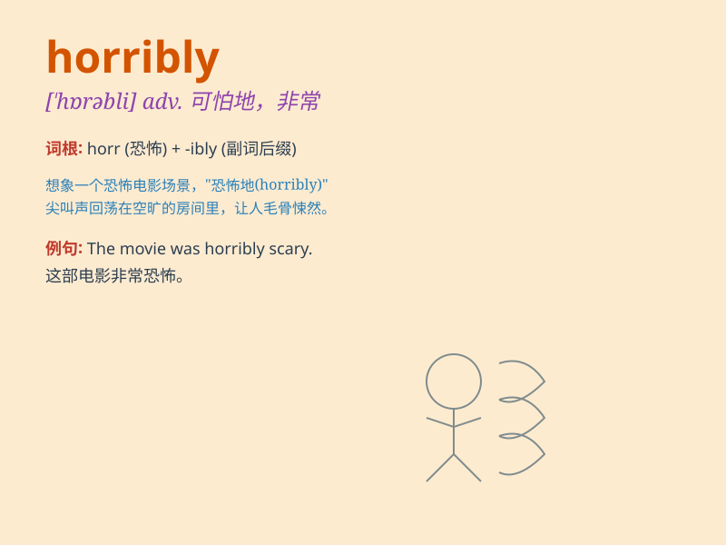

## horribly

**英音:** _[\'hɒrəbli]_ **美音:** _[\'hɒrəbli]_

**译义:** *adv.可怕地,非常地*

### 短语

+ **horribly wrong:** _大错特错_

+ **horribly ill:** _病得很重_

+ **horribly painful:** _极其痛苦_

+ **horribly frightened:** _极度惊恐_

+ **horribly damaged:** _严重损坏_

### 例句

#### 例句1

> **The accident was horribly tragic.**

**中文翻译:** 这场事故极其悲惨。

**单词释义:** 极其；非常

#### 例句2

> **She was horribly scared of spiders.**

**中文翻译:** 她非常害怕蜘蛛。

**单词释义:** 非常；极度地

#### 例句3

> **The food tasted horribly bad.**

**中文翻译:** 这食物尝起来非常糟糕。

**单词释义:** 非常；极其

### 背诵小故事

> A brave knight was exploring a dark cave. Suddenly, he saw a horribly
ugly monster. Its face was distorted and its roar was terrifying. The
knight had never encountered such a horrible scene before.

**一位勇敢的骑士正在探索一个黑暗的洞穴。突然，他看到了一个极其丑陋的怪物。它的脸扭曲着，吼声令人恐惧。骑士以前从未遇到过如此可怕的场景。**

### 图义

