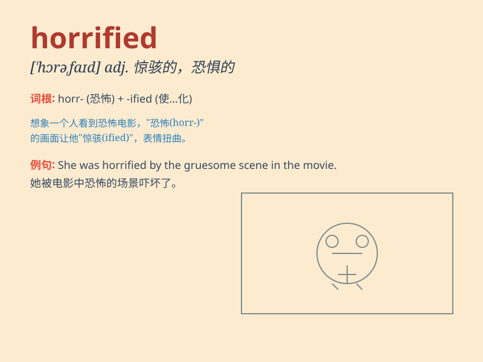

## horrified

**英音:** _[ˈhɒrɪfaɪd]_ **美音:** _[ˈhɔːrɪfaɪd]_

**译义:** *adj.惊悸的,带有恐怖感的,惊骇的*

### 短语

+ **be horrified at:** _对\...\...感到震惊_

+ **horrified expression:** _惊恐的表情_

+ **feel horrified:** _感到恐惧_

+ **horrified look:** _惊恐的神色_

+ **horrified scream:** _惊恐的尖叫_

### 例句

#### 例句1

> **I was horrified when I saw the car accident.**

**中文翻译:** 当我看到那场车祸时，我感到惊恐。

**单词释义:** 感到惊恐

#### 例句2

> **She looked horrified at the thought of going bungee jumping.**

**中文翻译:** 一想到要去蹦极，她就露出惊恐的表情。

**单词释义:** 惊恐的

#### 例句3

> **The children were horrified by the horror movie.**

**中文翻译:** 孩子们被那部恐怖电影吓坏了。

**单词释义:** 被吓坏

### 背诵小故事

> A girl was walking alone in a dark forest. Suddenly, she saw a
terrifying monster. She was horrified and couldn\'t move. The monster\'s
ugly face and sharp teeth made her heart race.

**一个女孩独自在黑暗的森林里行走。突然，她看到了一个可怕的怪物。她被吓坏了，动弹不得。怪物丑陋的脸和锋利的牙齿让她心跳加速。**

### 图义

