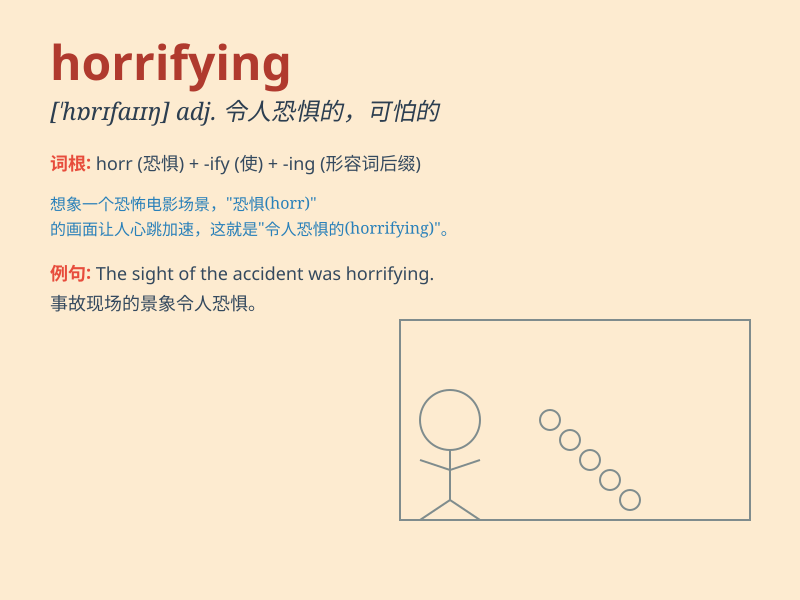

## horrifying

**英音:** _[ˈhɒrɪfaɪɪŋ]_ **美音:** _[ˈhɔːrɪfaɪɪŋ]_

**译义:** *adj.令人极其震惊的；使人毛骨悚然的*

### 短语

+ **horrifying experience:** _可怕的经历_

+ **horrifying scene:** _恐怖的场景_

+ **horrifying accident:** _骇人的事故_

+ **horrifying story:** _令人毛骨悚然的故事_

+ **horrifying nightmare:** _可怕的噩梦_

### 例句

#### 例句1

> **The accident was a horrifying experience for everyone
involved.**

**中文翻译:** 这次事故对每个相关人员来说都是一次可怕的经历。

**单词释义:** 令人极其震惊的；使人毛骨悚然的

#### 例句2

> **The movie contained some horrifying scenes of violence.**

**中文翻译:** 这部电影包含了一些令人恐惧的暴力场景。

**单词释义:** 令人恐惧的

#### 例句3

> **The thought of losing her job was horrifying to her.**

**中文翻译:** 想到会失去工作，她感到惊恐万分。

**单词释义:** 令人感到惊恐的

### 背诵小故事

> One night, I was walking alone in an old house. Suddenly, a
horrifying monster appeared in front of me. Its face was distorted and
its roar was terrifying. I was so scared that I couldn\'t move.

**一天晚上，我独自走在一座老房子里。突然，一个令人毛骨悚然的怪物出现在我面前。它的脸扭曲着，吼声令人恐惧。我吓得动弹不得。**

### 图义

