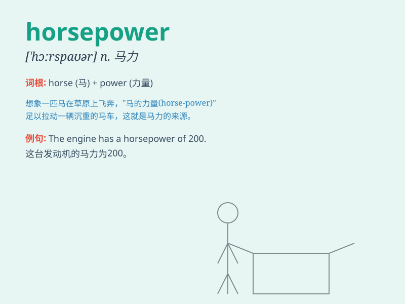

## horsepower

**英音:** _[\'hɔːspaʊə]_ **美音:** _[\'hɔrs\'paʊɚ]_

**译义:** *n.马力*

### 短语

+ **horsepower output:** _马力输出_

+ **horsepower rating:** _马力额定值_

+ **increase horsepower:** _增加马力_

+ **high horsepower:** _高马力_

+ **horsepower unit:** _马力单位_

### 例句

#### 例句1

> **The car has a horsepower of 200.**

**中文翻译:** 这辆车的马力为200。

**单词释义:** 马力

#### 例句2

> **The new engine delivers more horsepower than the old one.**

**中文翻译:** 新发动机比旧发动机提供更多马力。

**单词释义:** 马力

#### 例句3

> **We need to increase the horsepower of the machine to improve its
performance.**

**中文翻译:** 我们需要增加机器的马力来提高其性能。

**单词释义:** 马力

### 背诵小故事

> A young inventor was working on a machine. He needed to measure its
strength. He thought, \'I\'ll call it by combining horse and power, as a
horse is strong. So, he named it horsepower.\'

**一位年轻的发明家正在研究一台机器。他需要测量其力量。他想：'我将把马和力量结合起来称呼它，因为马很强壮。'于是，他把它命名为马力。**

### 图义

