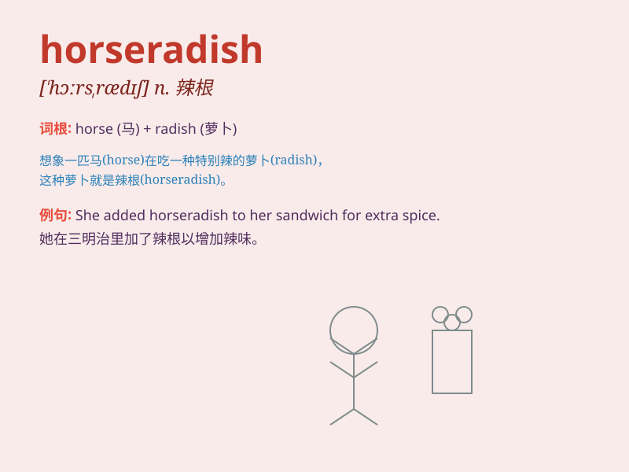

## horseradish

**英音:** _[\'hɔːsrædɪʃ]_ **美音:** _[\'hɔrs\'rædɪʃ]_

**译义:** *n.山葵,其根所制调味剂*

### 短语

+ **horseradish sauce:** _辣根酱_

+ **fresh horseradish:** _新鲜辣根_

+ **horseradish root:** _辣根根_

+ **ground horseradish:** _磨碎的辣根_

+ **horseradish extract:** _辣根提取物_

### 例句

#### 例句1

> **I don\'t like the taste of horseradish.**

**中文翻译:** 我不喜欢辣根的味道。

**单词释义:** 辣根（一种植物，其根可制成调味品）

#### 例句2

> **The chef added some horseradish to the sauce to give it a
kick.**

**中文翻译:** 厨师在酱汁中添加了一些辣根，以增加其风味。

**单词释义:** 辣根（此处指用于调味的辣根）

#### 例句3

> **Horseradish is often used as a condiment for roast beef.**

**中文翻译:** 辣根常被用作烤牛肉的调味品。

**单词释义:** 辣根（用作佐料的辣根）

### 背诵小故事

> One day, a horse was very hungry. It found a strange plant and ate
it. But the taste was so spicy! Later, people knew this plant was called
horseradish. The horse\'s adventure made us remember this word.

**有一天，一匹马非常饿。它发现了一种奇怪的植物并吃了下去。但味道太辣了！后来，人们知道这种植物叫做辣根。这匹马的冒险让我们记住了这个单词。**

### 图义

