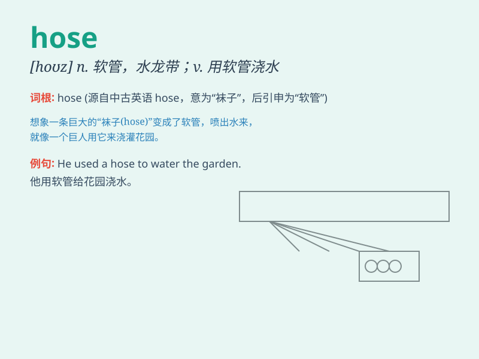

## hose

**英音:** _[həʊz]_ **美音:** _[hoz]_

**译义:** *n.软管,水龙带,长筒袜v.用软管浇水*

### 短语

+ **fire hose:** _消防水带_

+ **garden hose:** _花园浇水软管_

+ **hose down:** _用水管冲洗_

+ **rubber hose:** _橡胶软管_

+ **hosepipe ban:** _禁止使用水管_

### 例句

#### 例句1

> **The fireman used a hose to put out the fire.**

**中文翻译:** 消防员使用水龙带将火扑灭。

**单词释义:** 水管；软管

#### 例句2

> **She watered the garden with a hose.**

**中文翻译:** 她用软管给花园浇水。

**单词释义:** 水管；软管

#### 例句3

> **The hose was leaking.**

**中文翻译:** 软管漏水了。

**单词释义:** 软管

### 背诵小故事

> One hot summer day, a fire broke out. The firefighters quickly came
and used the hose to spray water. The powerful hose saved the day by
putting out the fire.

**在一个炎热的夏日，发生了一场火灾。消防员迅速赶来，并用消防水管喷水。强大的水管成功扑灭了大火，挽救了局面。**

### 图义

