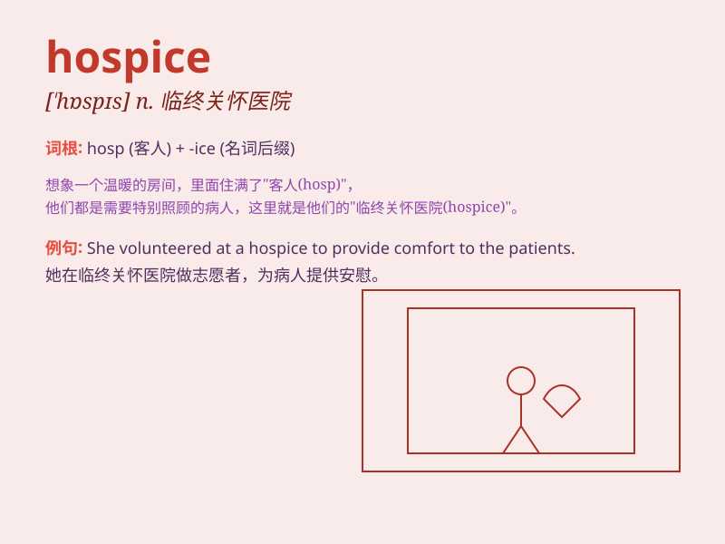

## hospice

**英音:** _[\'hɒspɪs]_ **美音:** _[\'hɑspɪs]_

**译义:** *n.旅客住宿处,收容所,济贫院*

### 短语

+ **hospice care:** _临终关怀_

+ **hospice patient:** _临终关怀病人_

+ **hospice nurse:** _临终关怀护士_

+ **hospice volunteer:** _临终关怀志愿者_

+ **local hospice:** _当地的临终关怀机构_

### 例句

#### 例句1

> **The hospice provides compassionate care for terminally ill
patients.**

**中文翻译:** 临终关怀中心为绝症患者提供富有同情心的护理。

**单词释义:** 临终关怀医院

#### 例句2

> **She decided to volunteer at the hospice to offer support to those
in need.**

**中文翻译:** 她决定在临终关怀中心做志愿者，为有需要的人提供支持。

**单词释义:** 临终关怀医院

#### 例句3

> **The hospice is a peaceful place where patients can spend their
final days with dignity.**

**中文翻译:**
临终关怀医院是一个宁静的地方，患者可以有尊严地度过最后的日子。

**单词释义:** 临终关怀医院

### 背诵小故事

> A man was seriously ill and sent to a hospice. There, he received
kind care and comfort in his final days. The hospice was a peaceful
place full of love and support.

**一个男人病重被送进了临终安养院。在那里，他在最后的日子里得到了亲切的关怀和安慰。临终安养院是一个充满爱和支持的宁静之地。**

### 图义

