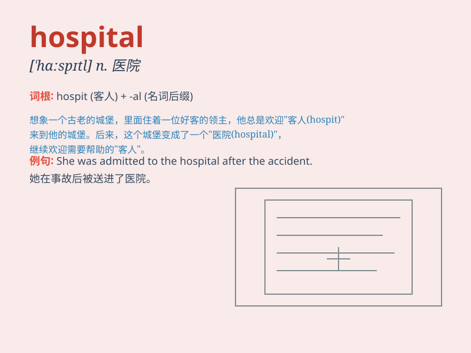

## hospital

**英音:** _[\'hɒspɪt(ə)l]_ **美音:** _[\'hɑspɪtl]_

**译义:** *n.医院*

### 短语

+ **hospital bed:** _病床_

+ **hospital staff:** _医院员工_

+ **hospital admission:** _入院_

+ **hospital visit:** _医院探访_

+ **hospital gown:** _病号服_

### 例句

#### 例句1

> **He was rushed to the hospital after the accident.**

**中文翻译:** 事故发生后，他被紧急送往医院。

**单词释义:** 医院

#### 例句2

> **The hospital has the most advanced medical equipment.**

**中文翻译:** 医院拥有最先进的医疗设备。

**单词释义:** 医院

#### 例句3

> **She works as a nurse in a children\'s hospital.**

**中文翻译:** 她在一家儿童医院担任护士。

**单词释义:** 医院

### 背诵小故事

> One day, Tom was playing football and got hurt. His friends quickly
took him to the hospital. There, kind doctors and nurses helped him get
better. Hospital is a place where we get treated when we are sick or
injured.

**有一天，汤姆踢足球受伤了。他的朋友们迅速把他送到了医院。在那里，善良的医生和护士帮助他康复。医院是我们生病或受伤时接受治疗的地方。**

### 图义

