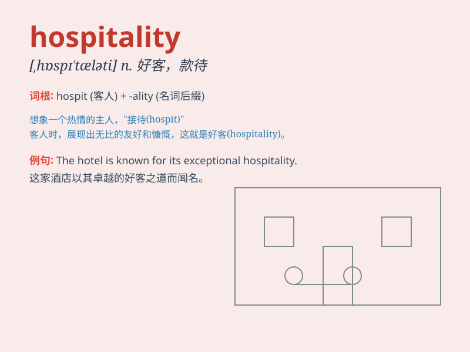

## hospitality

**英音:** _[hɒspɪ\'tælɪtɪ]_ **美音:** _[,hɑspɪ\'tæləti]_

**译义:** *n.好客,宜人,盛情*

### 短语

+ **hospitality industry:** _酒店业；款待业_

+ **hospitality management:** _酒店管理_

+ **show hospitality:** _表示好客_

+ **warm hospitality:** _热情款待_

+ **extend hospitality:** _给予款待_

### 例句

#### 例句1

> **The hospitality of the local people made our trip very
enjoyable.**

**中文翻译:** 当地人的热情好客让我们的旅行非常愉快。

**单词释义:** 热情好客

#### 例句2

> **The hotel is known for its excellent hospitality.**

**中文翻译:** 该酒店以其卓越的热情好客而闻名。

**单词释义:** 款待

#### 例句3

> **We experienced true hospitality during our stay at their
home.**

**中文翻译:** 在他们家住宿期间，我们体验到了真正的热情好客。

**单词释义:** 热情款待

### 背诵小故事

> Once I got lost in a strange city. Exhausted and worried, I was
greeted with warmth and kindness. People offered me food and a place to
rest. Their hospitality made me feel at home.

**有一次我在一个陌生的城市迷路了。又累又担心，我却受到了热情和友好的对待。人们给我提供食物和休息的地方。他们的好客让我有了家的感觉。**

### 图义

