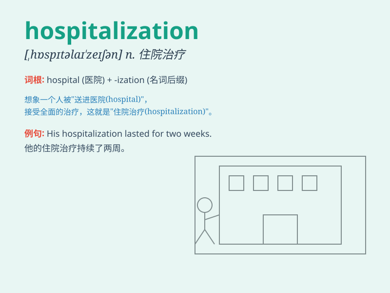

## hospitalization

**英音:** _[ˌhɒspɪtəlaɪˈzeɪʃn]_ **美音:**
_[ˌhɑːspɪtələˈzeɪʃn]_

**译义:** *n.住院治疗；住院*

### 短语

+ **emergency hospitalization:** _紧急住院_

+ **require hospitalization:** _需要住院_

+ **hospitalization expenses:** _住院费用_

+ **avoid hospitalization:** _避免住院_

+ **prolonged hospitalization:** _长期住院_

### 例句

#### 例句1

> **The patient\'s hospitalization was necessary due to a severe
infection.**

**中文翻译:** 由于严重感染，这位病人的住院治疗是必要的。

**单词释义:** 住院治疗

#### 例句2

> **Long-term hospitalization can have a significant impact on a
person\'s mental health.**

**中文翻译:** 长期住院可能对一个人的心理健康产生重大影响。

**单词释义:** 住院

#### 例句3

> **The cost of hospitalization for this illness is quite high.**

**中文翻译:** 这种疾病的住院费用相当高。

**单词释义:** 住院

### 背诵小故事

> One day, Tom was very sick and needed to stay in the hospital for a
long time. This process of being admitted and cared for in the hospital
is called hospitalization.

**一天，汤姆病得很重，需要在医院住很长时间。这种入住医院并接受照料的过程就叫做住院治疗。**

### 图义

