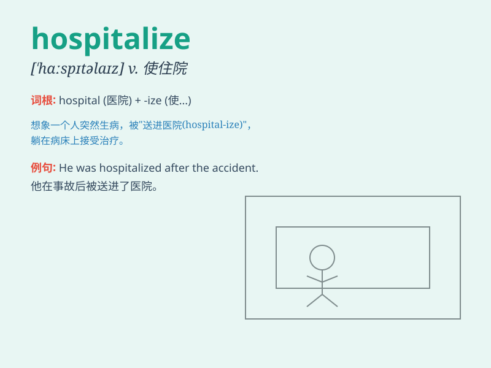

## hospitalize

**英音:** _[\'hɒspɪt(ə)laɪz]_ **美音:**
_[\'hɑspɪtə\'laɪz]_

**译义:** *vt.就医*

### 短语

+ **be hospitalized:** _住院；被送进医院_

+ **hospitalize someone:** _送某人住院_

+ **hospitalize for:** _因\...\...而住院_

+ **emergency hospitalize:** _紧急住院_

+ **voluntary hospitalize:** _自愿住院_

### 例句

#### 例句1

> **He was hospitalized after the car accident.**

**中文翻译:** 车祸后他被送往医院。

**单词释义:** 送\...\...住院

#### 例句2

> **The doctor decided to hospitalize her for further tests.**

**中文翻译:** 医生决定将她住院接受进一步检查。

**单词释义:** 使住院

#### 例句3

> **She was seriously ill and had to be hospitalized immediately.**

**中文翻译:** 她病得很重，必须立即住院治疗。

**单词释义:** 把\...\...送进医院治疗

### 背诵小故事

> One day, Tom was so sick that his family had to call an ambulance. He
was taken to the hospital and hospitalize d. Doctors and nurses worked
hard to make him better.

**一天，汤姆病得很重，他的家人不得不叫救护车。他被送到医院并住院了。医生和护士努力工作让他好起来。**

### 图义

