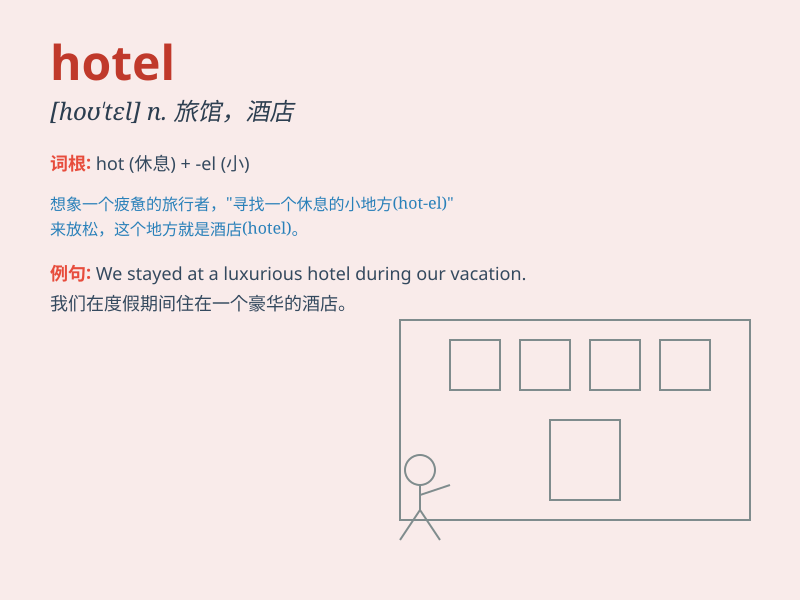

## hotel

**英音:** _[həʊˈtel]_ **美音:** _[ho\'tɛl]_

**译义:** *n.旅馆,客栈,\<俚>监狱*

### 短语

+ **hotel room:** _酒店房间_

+ **hotel lobby:** _酒店大堂_

+ **hotel reservation:** _酒店预订_

+ **hotel staff:** _酒店员工_

+ **hotel service:** _酒店服务_

### 例句

#### 例句1

> **I stayed at a luxurious hotel during my vacation.**

**中文翻译:** 假期期间我住在一家豪华酒店。

**单词释义:** 酒店

#### 例句2

> **The hotel offers excellent room service.**

**中文翻译:** 酒店提供优质的客房服务。

**单词释义:** 酒店

#### 例句3

> **They are building a new hotel near the airport.**

**中文翻译:** 他们正在机场附近建造一家新旅馆。

**单词释义:** 酒店

### 背诵小故事

> One day, Tom was lost in a strange city. He was very tired and
hungry. Luckily, he found a hotel. The hotel was warm and comfortable,
and he had a good rest there.

**一天，汤姆在一个陌生的城市迷路了。他又累又饿。幸运的是，他找到了一家旅馆。这家旅馆温暖又舒适，他在那里好好休息了一番。**

### 图义

