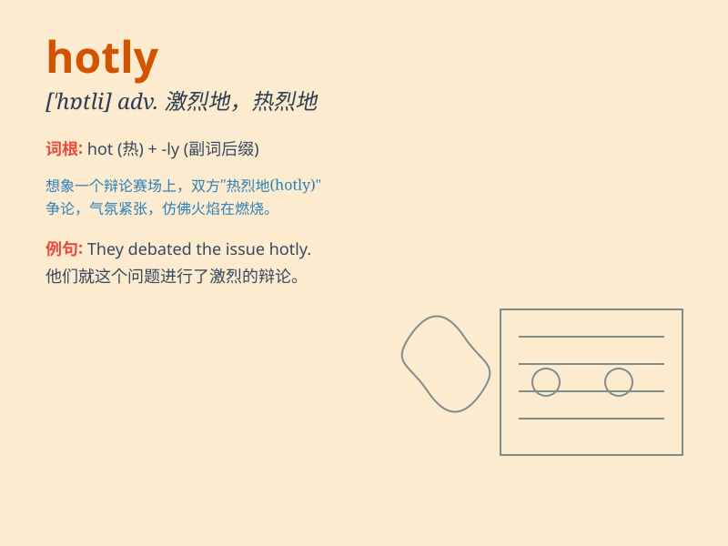

## hotly

**英音:** _[ˈhɒtli]_ **美音:** _[ˈhɑːtli]_

**译义:** *adv.暑热地,热心地,激烈地*

### 短语

+ **hotly contested:** _激烈争论的_

+ **hotly pursued:** _被热烈追求的_

+ **hotly debated:** _激烈辩论的_

+ **hotly anticipated:** _热切期待的_

+ **hotly denied:** _强烈否认的_

### 例句

#### 例句1

> **The issue was hotly debated among the politicians.**

**中文翻译:** 这个问题在政界人士中引起了激烈争论。

**单词释义:** 激烈地

#### 例句2

> **She was hotly pursued by the paparazzi.**

**中文翻译:** 她受到狗仔队的热烈追捧。

**单词释义:** 紧紧地

#### 例句3

> **The new policy was hotly contested by the public.**

**中文翻译:** 新政策受到了公众的激烈争论。

**单词释义:** 强烈地

### 背诵小故事

> In a desert race, the competitors were running hotly. One runner was
so eager to win that he was sweating profusely. \'Hotly\' here shows the
intensity and passion.

**在一场沙漠赛跑中，参赛者们激烈地奔跑着。有一个选手非常渴望获胜，以至于大汗淋漓。'hotly'在这里体现了激烈和热情。**

### 图义

