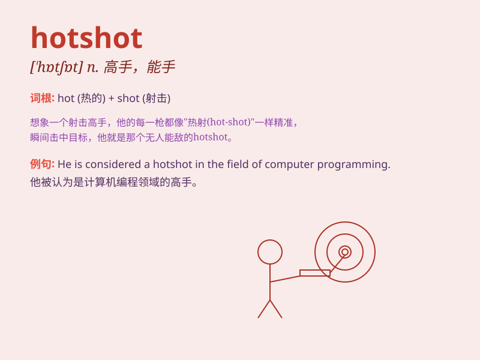

## hotshot

**英音:** _[\'hɒtʃɒt]_ **美音:** _[\'hɑtʃɑt]_

**译义:** *n.快车*

### 短语

+ **hotshot lawyer:** _杰出的律师_

+ **hotshot athlete:** _出色的运动员_

+ **hotshot executive:** _能干的主管_

+ **hotshot entrepreneur:** _成功的企业家_

+ **hotshot musician:** _优秀的音乐家_

### 例句

#### 例句1

> **He\'s a hotshot in the tech industry.**

**中文翻译:** 他是科技行业的炙手可热的人物。

**单词释义:** 高手；能人

#### 例句2

> **The new manager is seen as a hotshot who can turn the company
around.**

**中文翻译:** 新任经理被视为能够扭转公司局面的能人。

**单词释义:** 有能力的人；本领高强的人

#### 例句3

> **Don\'t think you\'re a hotshot just because you got one
promotion.**

**中文翻译:** 不要仅仅因为获得了一次晋升就认为自己是一名能干的人。

**单词释义:** 自命不凡的人；自以为是的人

### 背诵小故事

> There was a young man in the office who was always called a hotshot.
He was very confident and could solve difficult problems quickly. But
one day, he faced a huge challenge and realized that being a hotshot
also needed to keep learning.

**办公室里有个年轻人总是被称为高手。他非常自信，能迅速解决难题。但有一天，他面临巨大挑战，意识到身为高手也需要不断学习。**

### 图义

