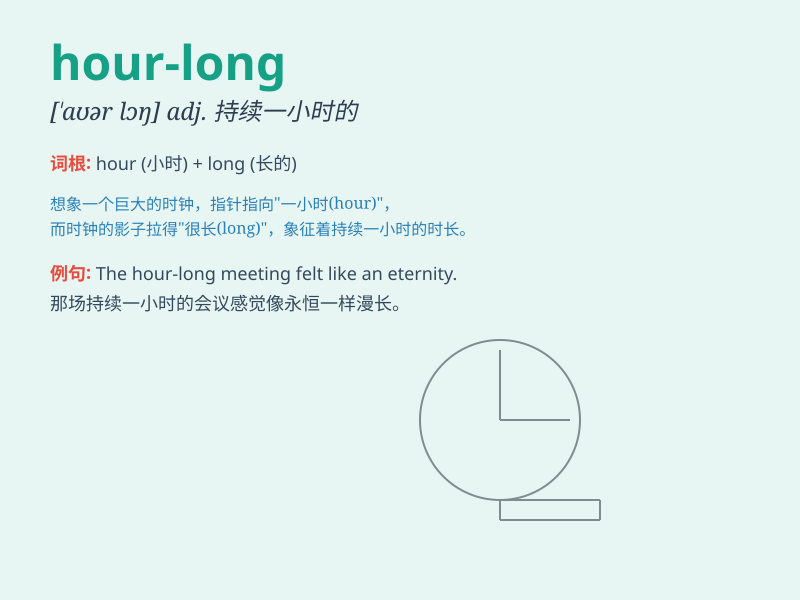

## hour-long

**英音:** _[aʊər lɒŋ]_ **美音:** _[aʊər lɔːŋ]_

**译义:** *adj.持续一小时的；长达一小时的*

### 短语

+ **hour-long meeting:** _长达一小时的会议_

+ **hour-long lecture:** _一小时长的讲座_

+ **hour-long workout:** _一小时的锻炼_

+ **hour-long discussion:** _一小时的讨论_

+ **hour-long presentation:** _一小时的展示_

### 例句

#### 例句1

> **The concert was an hour-long and it was amazing.**

**中文翻译:** 这场音乐会持续了一个小时，非常精彩。

**单词释义:** 长达一小时的

#### 例句2

> **We had an hour-long meeting to discuss the new project.**

**中文翻译:** 我们开了一个小时的会来讨论新项目。

**单词释义:** 长达一小时的

#### 例句3

> **She took an hour-long walk in the park every morning.**

**中文翻译:** 她每天早上在公园散步一小时。

**单词释义:** 长达一小时的

### 背诵小故事

> Imagine you are in a race. The track is hour-long, meaning it takes
exactly one hour to finish. You keep running, and when the hour is up,
you reach the finish line. So, \'hour-long\' means lasting for one hour.

**想象一下你在赛跑。赛道是一小时长的，这意味着跑完正好需要一个小时。你一直跑，当一小时结束时，你到达终点线。所以，\'hour-long\'意思是持续一小时。**

### 图义

