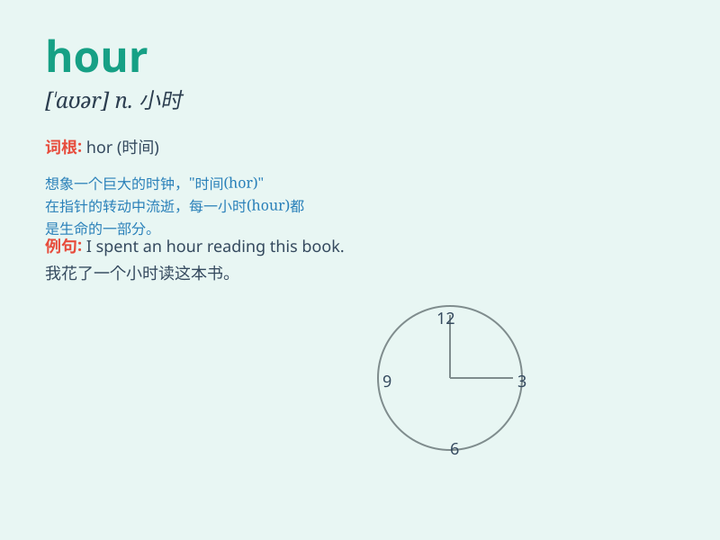

## hour

**英音:** _[\'aʊə]_ **美音:** _[\'aʊr]_

**译义:** *n.小时,钟头,\...点钟,课时,(一段)时间*

### 短语

+ **an hour:** _一小时_

+ **half an hour:** _半小时_

+ **per hour:** _每小时_

+ **rush hour:** _（上下班时的）交通高峰期_

+ **hour after hour:** _一小时又一小时；连续地_

### 例句

#### 例句1

> **I\'ll be back in an hour.**

**中文翻译:** 我一小时后回来。

**单词释义:** 小时

#### 例句2

> **The meeting lasted for two hours.**

**中文翻译:** 会议持续了两个小时。

**单词释义:** 小时

#### 例句3

> **It\'s five hours\' drive from here to there.**

**中文翻译:** 从这里到那里有五个小时的车程。

**单词释义:** 小时

### 背诵小故事

> One day, a little boy was very excited because he had only one hour
left to finish his favorite game. He kept looking at the clock, waiting
for that precious hour to pass quickly.

**一天，一个小男孩非常兴奋，因为他只剩一个小时来完成他最喜欢的游戏。他一直盯着时钟，等待那宝贵的一小时快快过去。**

### 图义

