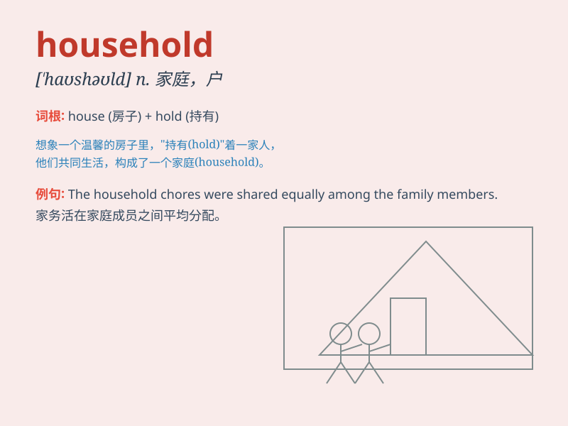

## household

**英音:** _[\'haʊshəʊld]_ **美音:** _[\'haʊshold]_

**译义:**
*n.一家人,家庭,家族,王室adj.家庭的,家族的,家属的,普通的,平常的*

### 短语

+ **household goods:** _家庭用品_

+ **household name:** _家喻户晓的名字_

+ **household chores:** _家务杂活_

+ **household expenses:** _家庭开支_

+ **household income:** _家庭收入_

### 例句

#### 例句1

> **The household chores keep her busy every day.**

**中文翻译:** 家务活让她每天都忙得不可开交。

**单词释义:** 家庭，一家人

#### 例句2

> **Our household income has increased this year.**

**中文翻译:** 今年我们家庭的收入增加了。

**单词释义:** 家庭的

#### 例句3

> **Household appliances make our life more convenient.**

**中文翻译:** 家用电器让我们的生活更加方便。

**单词释义:** 家用的

### 背诵小故事

> A long time ago, in a small village, there was a big house. Everyone
living in that house formed a household. They shared joy and sadness
together. The word \'household\' means all the people living in a house.

**很久以前，在一个小村庄里，有一座大房子。住在那座房子里的所有人组成了一个家庭户。他们一起分享快乐和悲伤。单词"household"意思是住在一个房子里的所有人。**

### 图义

