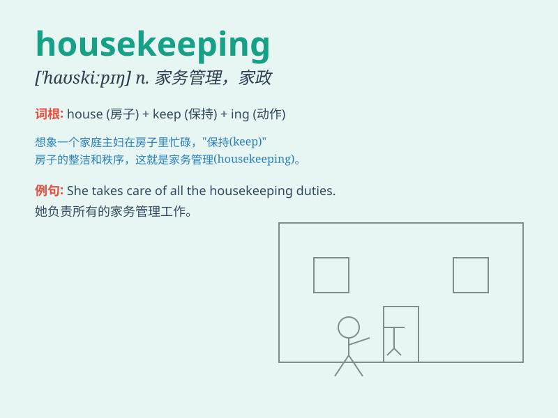

## housekeeping

**英音:** _[\'haʊskiːpɪŋ]_ **美音:** _[\'haʊskipɪŋ]_

**译义:** *n.家务管理*

### 短语

+ **good housekeeping:** _良好的家务管理；良好的内务处理_

+ **housekeeping staff:** _客房服务人员；后勤人员_

+ **housekeeping department:** _客房部；总务部_

+ **routine housekeeping:** _日常家务；日常内务管理_

+ **housekeeping service:** _客房服务；家政服务_

### 例句

#### 例句1

> **The hotel has excellent housekeeping services.**

**中文翻译:** 酒店提供优质的家政服务。

**单词释义:** 客房服务

#### 例句2

> **She is responsible for the housekeeping of the office.**

**中文翻译:** 她负责办公室的内务管理。

**单词释义:** 日常清洁工作

#### 例句3

> **Good housekeeping helps maintain a tidy home.**

**中文翻译:** 良好的家务管理有助于保持家居整洁。

**单词释义:** 家务管理

### 背诵小故事

> Once upon a time, a little girl was assigned the task of
housekeeping. She cleaned the rooms, did the laundry, and made the house
neat and tidy. Housekeeping means taking care of a house and doing all
the necessary chores.

**从前，有个小女孩被分配了家务管理的任务。她打扫房间、洗衣服，把房子弄得整洁干净。housekeeping
意思是打理家务，做所有必要的家务杂事。**

### 图义

