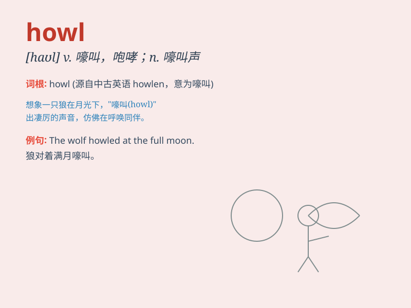

## howl

**英音:** _[haʊl]_ **美音:** _[haʊl]_

**译义:** *v.嚎叫,怒吼,嚎啕大哭,喝住,号叫n.嚎叫,怒号,嚎哭*

### 短语

+ **howl down:** _以大声喊叫压倒（某人的讲话）_

+ **howl with laughter:** _放声大笑_

+ **howl in pain:** _痛苦地嚎叫_

+ **howl at the moon:** _对着月亮嚎叫；徒然咆哮_

+ **give a howl:** _大声喊叫_

### 例句

#### 例句1

> **The wind howled through the trees.**

**中文翻译:** 风呼啸着穿过树林。

**单词释义:** 呼啸

#### 例句2

> **The dog howled mournfully when its owner left.**

**中文翻译:** 当主人离开时，狗发出悲伤的嚎叫。

**单词释义:** 嚎叫

#### 例句3

> **The wolves howled at the full moon.**

**中文翻译:** 狼群对着满月嚎叫。

**单词释义:** 嗥叫

### 背诵小故事

> One night, a wolf was alone in the forest and it began to howl. Its
howl was so loud and scary that it echoed through the trees. It seemed
like the wolf was expressing its loneliness or warning others.

**一天晚上，一只狼独自在森林里，它开始嚎叫。它的嚎叫声非常响亮和可怕，在树林中回荡。它似乎在表达它的孤独或警告其他人。**

### 图义

