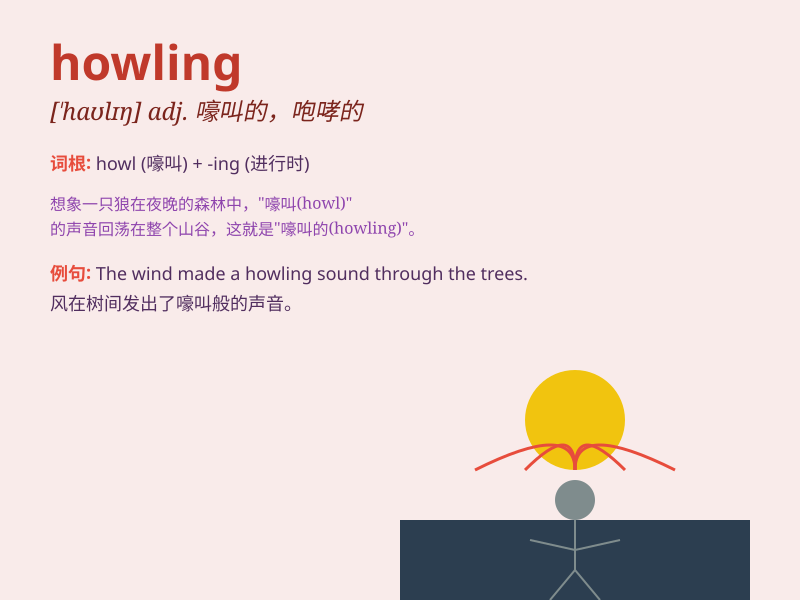

## howling

**英音:** _[\'haʊlɪŋ]_ **美音:** _[\'haʊlɪŋ]_

**译义:** *adj.嚎叫*

### 短语

+ **howling wind:** _呼啸的风_

+ **howling success:** _巨大的成功_

+ **howling wilderness:** _荒无人烟的旷野_

+ **howling mob:** _咆哮的暴徒_

+ **howling storm:** _狂风暴雨_

### 例句

#### 例句1

> **The howling wind made it difficult to sleep.**

**中文翻译:** 呼啸的风让人难以入睡。

**单词释义:** 呼啸的；咆哮的（形容风的声音）

#### 例句2

> **We could hear the howling of wolves in the distance.**

**中文翻译:** 我们能听到远处狼的嚎叫声。

**单词释义:** 嚎叫的（形容狼的叫声）

#### 例句3

> **The howling mob demanded justice.**

**中文翻译:** 咆哮的暴民要求正义。

**单词释义:** 咆哮的；怒吼的（形容人群的愤怒）

### 背诵小故事

> One night, I was walking in the forest. Suddenly, I heard a howling
sound. It was so scary. I realized it was a wolf howling at the moon.
The howling made my hair stand on end.

**一天晚上，我在森林里散步。突然，我听到一阵嚎叫声。太可怕了。我意识到那是一只狼对着月亮嚎叫。这嚎叫声让我毛骨悚然。**

### 图义

