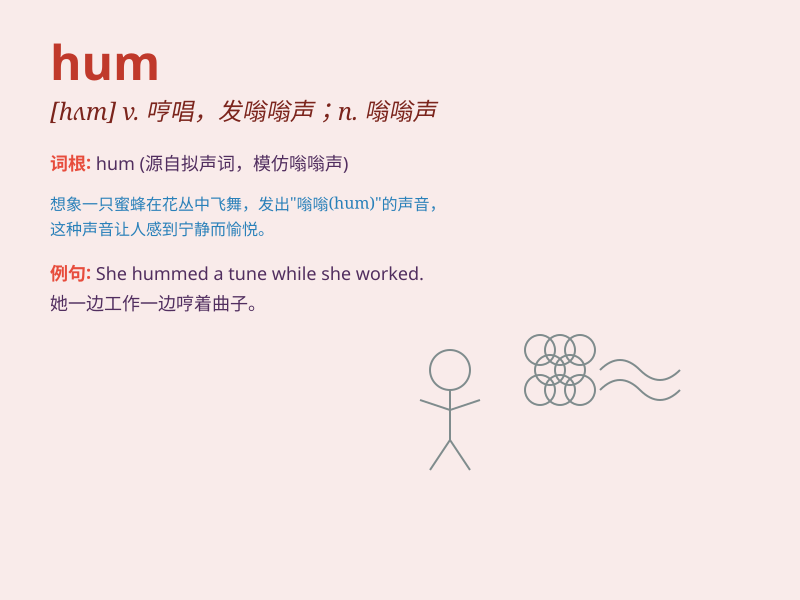

## hum

**英音:** _[hʌm]_ **美音:** _[hʌm]_

**译义:** *v.嗡嗡叫,哼n.嗡嗡声,吵杂声*

### 短语

+ **hum along:** _跟着哼唱_

+ **hum and haw:** _犹豫不决；支支吾吾_

+ **hum with activity:** _因活动而发出嗡嗡声_

+ **keep humming:** _持续哼唱_

+ **hum a tune:** _哼曲子_

### 例句

#### 例句1

> **The machine hummed quietly in the corner.**

**中文翻译:** 这台机器在角落里安静地嗡嗡作响。

**单词释义:** 发出嗡嗡声

#### 例句2

> **She hummed a tune as she worked.**

**中文翻译:** 她一边工作一边哼着小曲。

**单词释义:** 哼（曲子）

#### 例句3

> **The city hums with activity even at night.**

**中文翻译:** 这座城市即使在晚上也充满活力，热闹非凡。

**单词释义:** 充满（嘈杂声）

### 背诵小故事

> A bee was humming around the flowers. It made a soft hum that was so
calming. The hum of the bee reminded me of the word \'hum\'.

**一只蜜蜂在花丛周围嗡嗡叫。它发出轻柔的嗡嗡声，非常令人平静。蜜蜂的嗡嗡声让我想起了'hum'这个单词。**

### 图义

