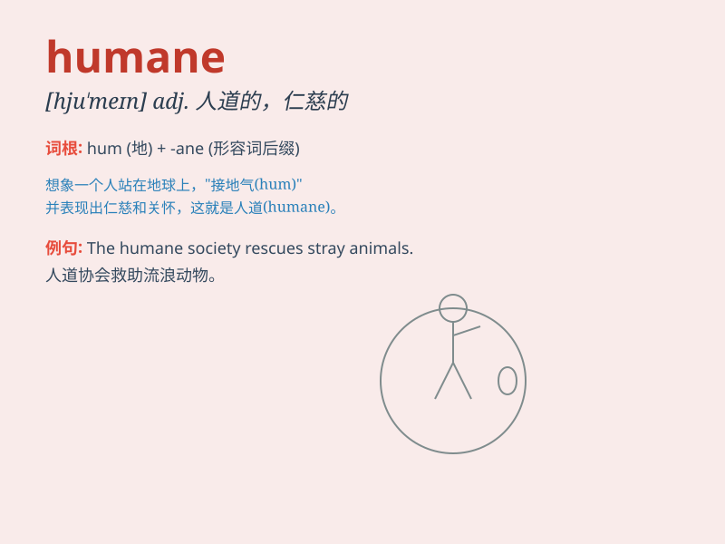

## humane

**英音:** _[hjʊ\'meɪn]_ **美音:** _[hju\'men]_

**译义:** *adj.仁慈的*

### 短语

+ **humane treatment:** _人道待遇_

+ **humane society:** _人道协会_

+ **humane values:** _人道价值观_

+ **humane education:** _人道教育_

+ **humane approach:** _人道方法_

### 例句

#### 例句1

> **The new law aims to ensure more humane treatment of
prisoners.**

**中文翻译:** 新法律旨在确保囚犯得到更人道的待遇。

**单词释义:** 人道的

#### 例句2

> **It is not humane to keep animals in small cages.**

**中文翻译:** 把动物关在小笼子里是不人道的。

**单词释义:** 人道的

#### 例句3

> **The doctor\'s approach was very humane when dealing with the
terminally ill patient.**

**中文翻译:** 医生在对待绝症患者时的方法非常人性化。

**单词释义:** 人性化的

### 背诵小故事

> A man was lost in the forest. Just when he felt hopeless, a kind and
humane hunter found him and led him out safely. The hunter\'s humane act
saved the man\'s life.

**一个男人在森林里迷路了。就在他感到绝望的时候，一位善良且人道的猎人发现了他，并安全地把他带了出去。猎人的人道行为救了这个男人的命。**

### 图义

