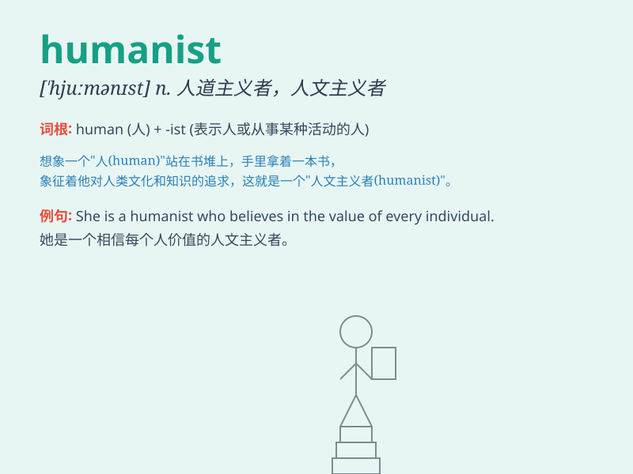

## humanist

**英音:** _[\'hjuːmənɪst]_ **美音:** _[\'hjʊmənɪst]_

**译义:** *n.人道主义者,人文主义者*

### 短语

+ **secular humanist:** _世俗人文主义者_

+ **Christian humanist:** _基督教人文主义者_

+ **Renaissance humanist:** _文艺复兴时期的人文主义者_

+ **classical humanist:** _古典人文主义者_

+ **modern humanist:** _现代人文主义者_

### 例句

#### 例句1

> **The humanist philosopher emphasized the importance of individual
freedom.**

**中文翻译:** 这位人道主义哲学家强调了个人自由的重要性。

**单词释义:** 人道主义者

#### 例句2

> **She is a well-known humanist who devotes herself to helping
others.**

**中文翻译:** 她是一位著名的人道主义者，致力于帮助他人。

**单词释义:** 人道主义者

#### 例句3

> **The humanist movement has gained significant support in recent
years.**

**中文翻译:** 人道主义运动近年来获得了显著的支持。

**单词释义:** 人道主义的

### 背诵小故事

> A long time ago, there was a wise man who cared deeply about
people\'s happiness and rights. He was called a humanist. He always
tried to make the world better for humans, focusing on their needs and
values.

**很久以前，有一位智者，他非常关心人们的幸福和权利。他被称为人道主义者。他总是努力让世界对人类更美好，关注人们的需求和价值。**

### 图义

