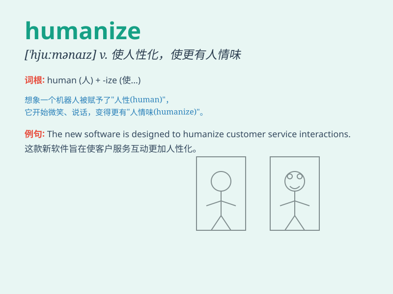

## humanize

**英音:** _[\'hjuːmənaɪz]_ **美音:** _[\'hjʊmə\'naɪz]_

**译义:** *vt.赋予人性,使通人情,教化vi.变为有人性,变为有情,有教化*

### 短语

+ **humanize education:** _使教育人性化_

+ **humanize working conditions:** _使工作条件人性化_

+ **humanize the law:** _使法律人道化_

+ **humanize medical treatment:** _使医疗人性化_

+ **humanize prison systems:** _使监狱制度人道化_

### 例句

#### 例句1

> **The new policy is aimed at humanizing the workplace.**

**中文翻译:** 这项新政策旨在使工作场所更人性化。

**单词释义:** 使人性化

#### 例句2

> **We need to humanize our approach to dealing with customers.**

**中文翻译:** 我们需要让我们对待客户的方式更人性化。

**单词释义:** 使更具人性

#### 例句3

> **Her story humanized the plight of the refugees.**

**中文翻译:** 她的故事使难民的困境更具人性化。

**单词释义:** 使变得有人情味

### 背诵小故事

> Once upon a time, a cold robot was transformed. Scientists gave it
emotions and kindness to humanize it. Now it could understand and care
like a real human.

**从前，有一个冰冷的机器人被改造。科学家赋予了它情感和善良来使其人性化。现在它能够像真正的人类一样理解和关心。**

### 图义

