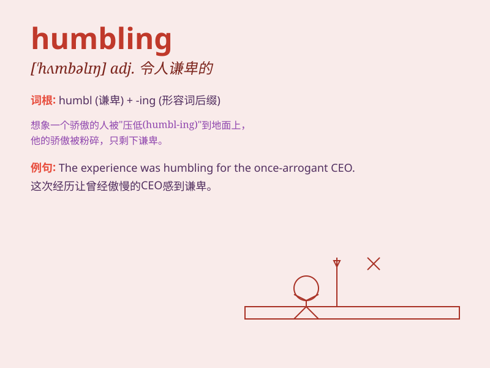

## humbling

**英音:** _[ˈhʌmblɪŋ]_ **美音:** _[ˈhʌmblɪŋ]_

**译义:** *adj.令人羞辱的*

### 短语

+ **a humbling experience:** _一次令人感到谦卑的经历_

+ **find it humbling:** _觉得这令人感到谦卑_

+ **humbling defeat:** _令人羞愧的失败_

+ **be humbling for someone:** _对某人来说是令人谦卑的_

+ **a humbling realization:** _一个令人谦卑的认识_

### 例句

#### 例句1

> **The experience of meeting those in need was humbling.**

**中文翻译:** 遇到那些需要帮助的人的经历令人感到谦卑。

**单词释义:** 令人感到谦卑的

#### 例句2

> **It was a humbling moment when she realized her mistakes.**

**中文翻译:** 当她意识到自己的错误时，那是一个令人谦卑的时刻。

**单词释义:** 令人谦卑的

#### 例句3

> **The success of his rivals was humbling for him.**

**中文翻译:** 对手的成功对他来说是令人自惭形秽的。

**单词释义:** 令人自惭形秽的

### 背诵小故事

> Once, a proud athlete always thought he was the best. But in a
crucial competition, he lost badly. This experience was humbling. It
made him realize he wasn\'t as great as he thought and needed to keep
improving.

**曾经，一位骄傲的运动员总认为自己是最棒的。但在一场关键比赛中，他输得很惨。这次经历是令人自惭的。这让他意识到自己并非像想象中那么出色，需要不断进步。**

### 图义

