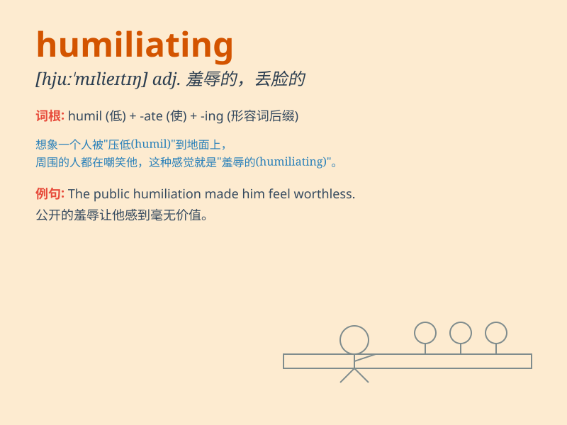

## humiliating

**英音:** _[hjuːˈmɪlieɪtɪŋ]_ **美音:**
_[hjuːˈmɪlieɪtɪŋ]_

**译义:** *adj.羞辱性的*

### 短语

+ **humiliating defeat:** _耻辱性的失败_

+ **humiliating experience:** _令人感到羞辱的经历_

+ **humiliating situation:** _令人蒙羞的处境_

+ **humiliating public exposure:** _令人羞辱的公开曝光_

+ **humiliating punishment:** _羞辱性的惩罚_

### 例句

#### 例句1

> **The experience was humiliating for him.**

**中文翻译:** 这次经历对他来说是耻辱的。

**单词释义:** 耻辱的；丢脸的

#### 例句2

> **She suffered a humiliating defeat in the competition.**

**中文翻译:** 她在比赛中遭遇了耻辱性的失败。

**单词释义:** 令人感到羞辱的

#### 例句3

> **It was a humiliating moment when he was caught cheating.**

**中文翻译:** 当他被抓到作弊时，那是一个丢脸的时刻。

**单词释义:** 使人蒙羞的

### 背诵小故事

> Once upon a time, a proud king was defeated in a battle and was
forced to wear ragged clothes and walk through the streets. This
experience was humiliating for him. It made him lose face and dignity.

**从前，一位骄傲的国王在一场战斗中被打败，被迫穿着破烂的衣服穿过街道。这种经历对他来说是耻辱的。这让他丢了脸，失去了尊严。**

### 图义

