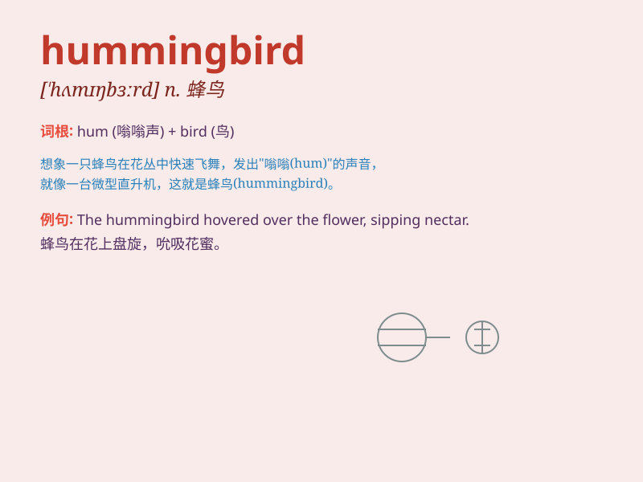

## hummingbird

**英音:** _[\'hʌmɪŋbɜːd]_ **美音:** _[\'hʌmɪŋbɝd]_

**译义:** *n.蜂雀*

### 短语

+ **ruby-throated hummingbird:** _红喉蜂鸟_

+ **hummingbird hawk-moth:** _小豆长喙天蛾_

+ **hummingbird feeder:** _蜂鸟喂食器_

+ **hummingbird flower:** _蜂鸟花_

+ **hummingbird migration:** _蜂鸟迁徙_

### 例句

#### 例句1

> **The hummingbird flitted from flower to flower, sipping
nectar.**

**中文翻译:** 蜂鸟在花丛间飞来飞去，吸食花蜜。

**单词释义:** 蜂鸟

#### 例句2

> **I was amazed to see a hummingbird hovering near the window.**

**中文翻译:** 我惊讶地看到一只蜂鸟在窗户附近盘旋。

**单词释义:** 蜂鸟

#### 例句3

> **The tiny hummingbird has a very fast wingbeat.**

**中文翻译:** 这只小小的蜂鸟翅膀扇动得非常快。

**单词释义:** 蜂鸟

### 背诵小故事

> One day, a little girl was in the garden. Suddenly, a fast-moving
bird appeared. It made a humming sound as it flew. The girl was amazed
and asked her mom what it was. Her mom said, \'It\'s a hummingbird.\'

**有一天，一个小女孩在花园里。突然，出现了一只飞得很快的鸟。它飞的时候发出嗡嗡声。小女孩很惊讶，问妈妈这是什么。妈妈说：'这是一只蜂鸟。'**

### 图义

