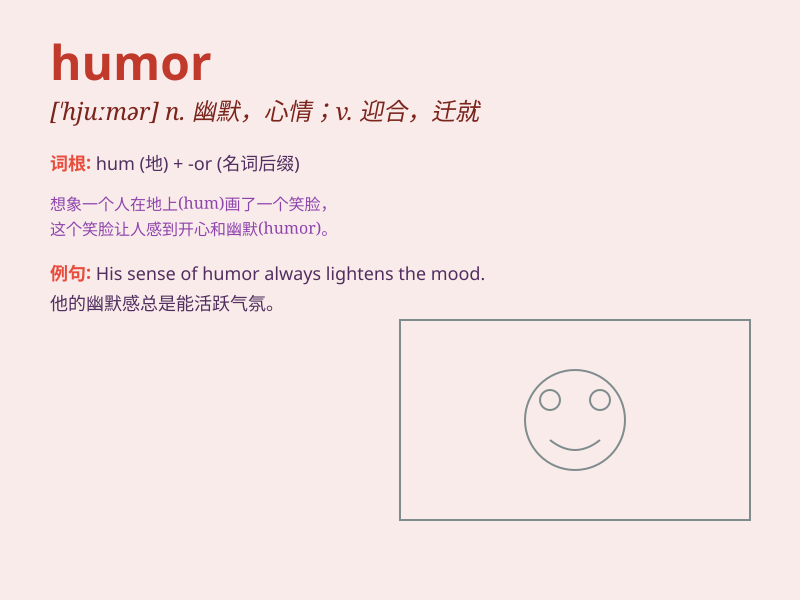

## humor

**英音:** _[ˈhjuːmə]_ **美音:** _[\'hjʊmɚ]_

**译义:** *n.幽默,心情,诙谐vt.迎合,牵就,顺应*

### 短语

+ **good humor:** _好心情；好脾气_

+ **black humor:** _黑色幽默（一种荒诞、病态或阴森恐怖的幽默）_

+ **sense of humor:** _幽默感_

+ **in a bad humor:** _心情不好；情绪不佳_

+ **out of humor:** _心情不好；生气_

### 例句

#### 例句1

> **He has a great sense of humor and always makes us laugh.**

**中文翻译:** 他很有幽默感，总是让我们大笑。

**单词释义:** 幽默感

#### 例句2

> **I appreciate your humor in this difficult situation.**

**中文翻译:** 在这种困难的情况下，我欣赏你的风趣。

**单词释义:** 风趣

#### 例句3

> **The movie is full of humor and surprises.**

**中文翻译:** 这部电影充满了幽默和惊喜。

**单词释义:** 幽默

### 背诵小故事

> One day, a clown was performing on the street. His funny actions and
expressions filled everyone with joy. This is the power of humor. It can
make people forget their troubles and laugh happily.

**有一天，一个小丑在街上表演。他滑稽的动作和表情让每个人都充满了欢乐。这就是幽默的力量。它能让人忘却烦恼，开心大笑。**

### 图义

