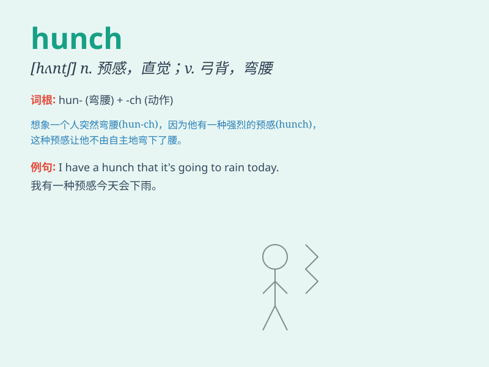

## hunch

**英音:** _[hʌn(t)ʃ]_ **美音:** _[hʌntʃ]_

**译义:**
*n.圆形之隆起物,肉峰,预感,大块vt.弯腰驼背,弓起背部,耸肩vi.向前移动,隆起*

### 短语

+ **have a hunch:** _有预感_

+ **act on a hunch:** _凭直觉行动_

+ **hunches and intuitions:** _预感和直觉_

+ **a hunch of shoulder:** _耸肩_

+ **follow one\'s hunch:** _跟着自己的直觉_

### 例句

#### 例句1

> **I have a hunch that it\'s going to rain today.**

**中文翻译:** 我有一种预感今天会下雨。

**单词释义:** 预感；直觉

#### 例句2

> **He acted on a hunch and bought the stock.**

**中文翻译:** 他凭直觉行事，买了那只股票。

**单词释义:** 直觉

#### 例句3

> **Her hunch proved correct when they found the lost keys.**

**中文翻译:** 当他们找到丢失的钥匙时，她的预感被证明是正确的。

**单词释义:** 预感

### 背诵小故事

> One day, while walking in the park, I had a hunch that I would find a
lost puppy. And guess what? I really did! My hunch led me to a corner
where the poor little thing was hiding.

**有一天，在公园散步时，我有一种预感，觉得自己会找到一只走失的小狗。你猜怎么着？我真的找到了！我的预感把我引到一个角落，那可怜的小家伙就藏在那里。**

### 图义

