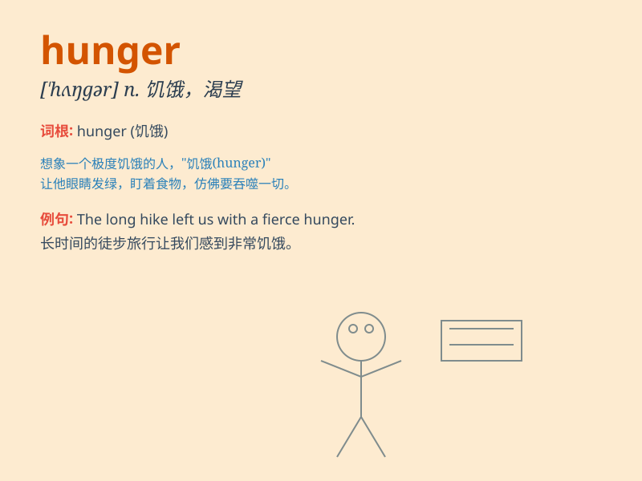

## hunger

**英音:** _[\'hʌŋgə]_ **美音:** _[\'hʌŋɡɚ]_

**译义:** *n.饥饿,欲望,渴望v.饥饿*

### 短语

+ **hunger strike:** _绝食抗议_

+ **hunger pang:** _饥饿的阵痛_

+ **die of hunger:** _死于饥饿_

+ **suffer from hunger:** _忍受饥饿_

+ **hunger for:** _渴望_

### 例句

#### 例句1

> **The child was crying from hunger.**

**中文翻译:** 这个孩子因为饥饿在哭。

**单词释义:** 饥饿

#### 例句2

> **He has a hunger for knowledge.**

**中文翻译:** 他有求知的渴望。

**单词释义:** 渴望

#### 例句3

> **The poor man suffered from hunger and cold.**

**中文翻译:** 这个穷人遭受着饥饿和寒冷。

**单词释义:** 饥饿

### 背诵小故事

> A poor boy was always in hunger. One day, he found a magical bread
tree. After eating the bread, his hunger vanished. But he learned to
share to help others overcome hunger too.

**一个贫穷的男孩总是处于饥饿状态。有一天，他发现了一棵神奇的面包树。吃了面包后，他的饥饿消失了。但他学会了分享，以帮助其他人也摆脱饥饿。**

### 图义

