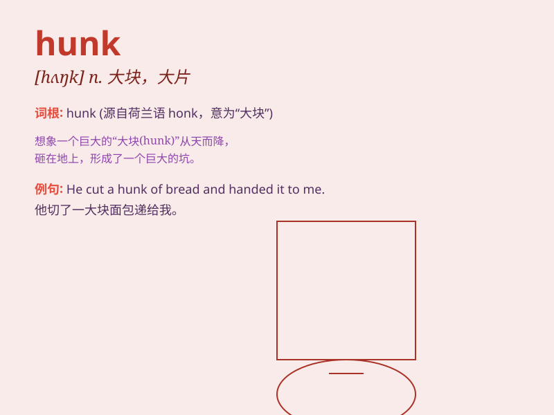

## hunk

**英音:** _[hʌŋk]_ **美音:** _[hʌŋk]_

**译义:** *n.\<俗>大块*

### 短语

+ **hunk of meat:** _一大块肉_

+ **hunk of cheese:** _一大块奶酪_

+ **hunk of bread:** _一大块面包_

+ **hunk of wood:** _一大块木头_

+ **hunk of stone:** _一大块石头_

### 例句

#### 例句1

> **He\'s a hunk with broad shoulders and a charming smile.**

**中文翻译:** 他是个身材魁梧、肩膀宽阔且笑容迷人的帅哥。

**单词释义:** 英俊健壮的男子

#### 例句2

> **She couldn\'t resist the hunk in the movie.**

**中文翻译:** 她无法抗拒电影里的那个帅哥。

**单词释义:** 有魅力的男子

#### 例句3

> **The hunk of meat was enough to feed the whole family.**

**中文翻译:** 那块大肉足以让全家吃饱。

**单词释义:** 大块，大片（尤指食物）

### 背诵小故事

> A hungry bear was looking for food in the forest. Suddenly, it saw a
hunk of honeycomb. The bear was so excited and forgot its hunger. It
enjoyed the sweet treat.

**一只饥饿的熊在森林里寻找食物。突然，它看到一大块蜂巢。熊非常兴奋，忘记了饥饿。它享受着这份甜蜜的美食。**

### 图义

