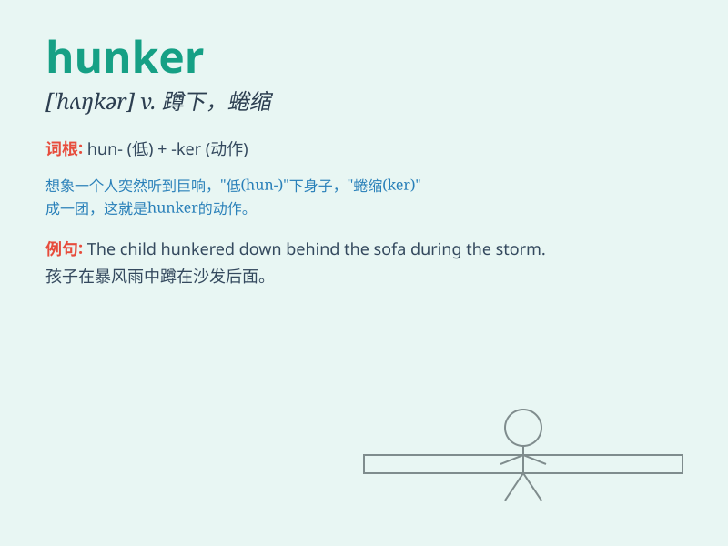

## hunker

**英音:** _[\'hʌŋkə]_ **美音:** _[\'hʌŋkɚ]_

**译义:** *vi.盘坐n.守旧者(首字母要大写,即Hunker)*

### 短语

+ **hunker down:** _蹲坐；蹲下；准备长期待在某处_

+ **hunker up:** _蜷缩；蹲伏_

+ **hunker in:** _躲在；藏在_

+ **hunker behind:** _躲在\...\...后面_

+ **hunker over:** _弯腰伏在\...\...上_

### 例句

#### 例句1

> **He hunkered down behind the wall to avoid being seen.**

**中文翻译:** 他蹲在墙后面以免被看见。

**单词释义:** 蹲下；弯腰屈膝地坐

#### 例句2

> **The soldiers hunkered in the trenches during the battle.**

**中文翻译:** 士兵们在战斗期间蹲守在战壕里。

**单词释义:** 蹲守；坚守

#### 例句3

> **She hunkered over her books, studying hard for the exam.**

**中文翻译:** 她弯腰伏在书本上，为考试努力学习。

**单词释义:** 弯腰伏在；俯身靠近

### 背诵小故事

> A man was hunkering down in a cave to avoid the strong wind. He held
his knees tightly, trying to stay warm. Finally, the wind stopped and he
could stand up. Remember, \'hunker\' means to squat or crouch down.

**一个男人为了躲避强风蹲在洞穴里。他紧紧地抱着膝盖，试图保持温暖。最后，风停了，他可以站起来了。记住，'hunker'意思是蹲下或蹲伏。**

### 图义

