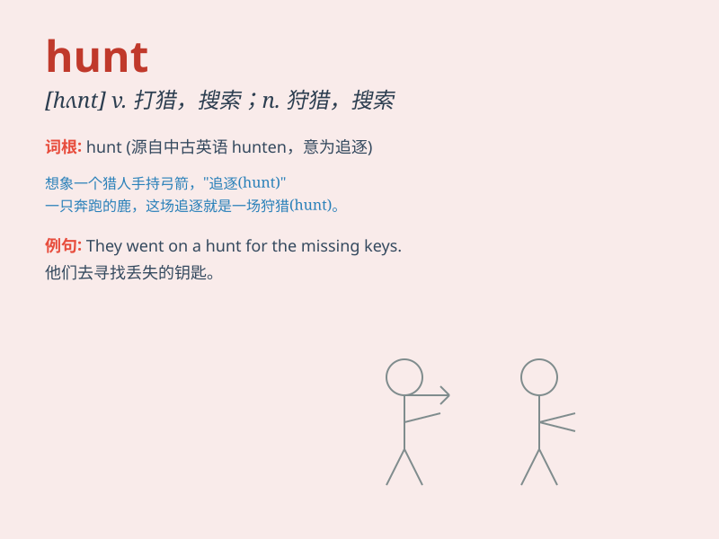

## hunt

**英音:** _[hʌnt]_ **美音:** _[hʌnt]_

**译义:** *v.打猎,猎取,搜索,搜寻,猎获n.打猎,猎取,搜索,搜寻,狩猎*

### 短语

+ **hunt for:** _寻找；搜寻_

+ **hunt down:** _追捕；追获_

+ **hunt out:** _找出；搜寻出_

+ **go hunting:** _去打猎_

+ **job hunt:** _找工作_

### 例句

#### 例句1

> **He goes hunting every weekend.**

**中文翻译:** 他每个周末都去打猎。

**单词释义:** 打猎

#### 例句2

> **The police are hunting for the thief.**

**中文翻译:** 警察正在追捕那个小偷。

**单词释义:** 追捕

#### 例句3

> **She spent hours hunting through the shops for a dress.**

**中文翻译:** 她花了几个小时在商店里寻找一件连衣裙。

**单词释义:** 寻找

### 背诵小故事

> A brave hunter named Tom went into the forest to hunt. He followed
the tracks and finally found a big deer. With his skills and patience,
he successfully caught it. Hunting needs courage and wisdom.

**一个勇敢的名叫汤姆的猎人走进森林去狩猎。他沿着足迹，最终发现了一只大鹿。凭借他的技能和耐心，他成功地捕获了它。狩猎需要勇气和智慧。**

### 图义

