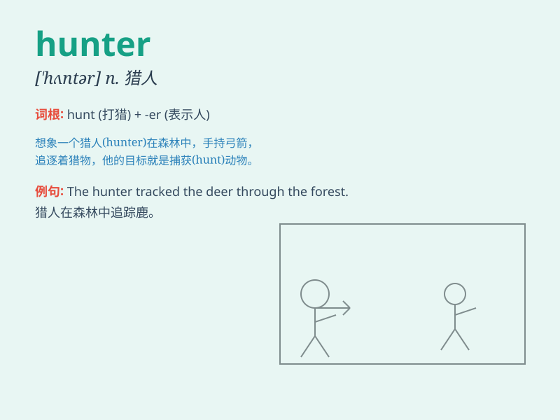

## hunter

**英音:** _[\'hʌntə]_ **美音:** _[\'hʌntɚ]_

**译义:** *n.猎人*

### 短语

+ **job hunter:** _求职者_

+ **head hunter:** _猎头_

+ **bargain hunter:** _买便宜货的人；四处觅购便宜货的人_

+ **treasure hunter:** _寻宝者_

+ **fame hunter:** _追名逐利者_

### 例句

#### 例句1

> **The hunter tracked the deer through the forest.**

**中文翻译:** 这位猎人穿过森林追踪那头鹿。

**单词释义:** 猎人

#### 例句2

> **She is a skilled hunter of rare books in the antique market.**

**中文翻译:** 她在古董市场是一位寻找珍本图书的高手。

**单词释义:** 搜寻者

#### 例句3

> **Job hunters are facing fierce competition in the current
market.**

**中文翻译:** 求职者在当前市场面临激烈的竞争。

**单词释义:** 求职者

### 背诵小故事

> One day, a brave man named Tom decided to become a hunter. He went
deep into the forest with his bow and arrow. After a long search, he
finally caught a big deer. Tom was very happy and proud of his hunting
skills.

**一天，一个叫汤姆的勇敢男人决定成为一名猎人。他带着弓箭深入森林。经过长时间的搜寻，他终于捕获了一只大鹿。汤姆非常高兴，并为自己的狩猎技能感到骄傲。**

### 图义

