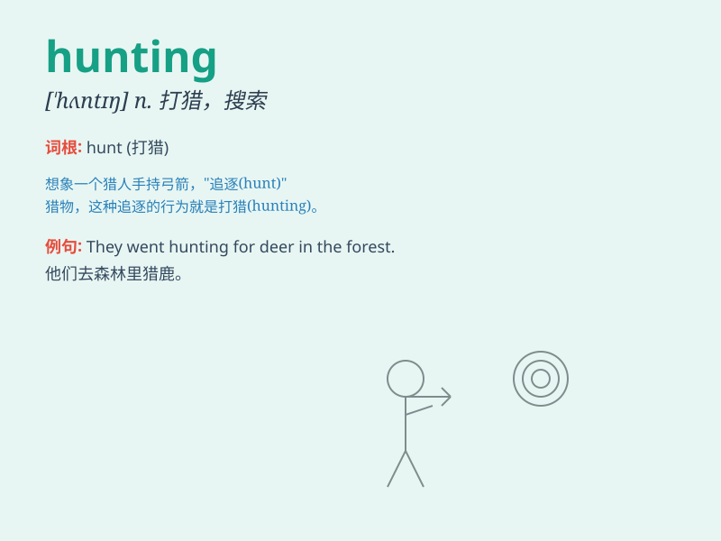

## hunting

**英音:** _[\'hʌntɪŋ]_ **美音:** _[\'hʌntɪŋ]_

**译义:** *n.打猎,搜索,追逐*

### 短语

+ **hunting ground:** _猎场；有希望找到所寻求东西的地方_

+ **hunting knife:** _猎刀_

+ **hunting season:** _狩猎季节_

+ **hunting party:** _狩猎队_

+ **hunting lodge:** _狩猎小屋_

### 例句

#### 例句1

> **He goes hunting every weekend.**

**中文翻译:** 他每个周末都去打猎。

**单词释义:** 打猎

#### 例句2

> **The hunting of endangered species is strictly prohibited.**

**中文翻译:** 濒危物种的捕猎是严格禁止的。

**单词释义:** 捕猎

#### 例句3

> **Job hunting can be a stressful process.**

**中文翻译:** 找工作可能是一个有压力的过程。

**单词释义:** 寻找

### 背诵小故事

> A brave boy named Tom went hunting in the forest. He carried a bow
and arrow, carefully looking for prey. After a long search, he finally
found a deer and made a successful hunt. Hunting requires patience and
skill.

**一个勇敢的叫汤姆的男孩去森林里打猎。他带着弓箭，仔细寻找猎物。经过长时间的搜寻，他终于发现了一只鹿并成功捕获。打猎需要耐心和技巧。**

### 图义

