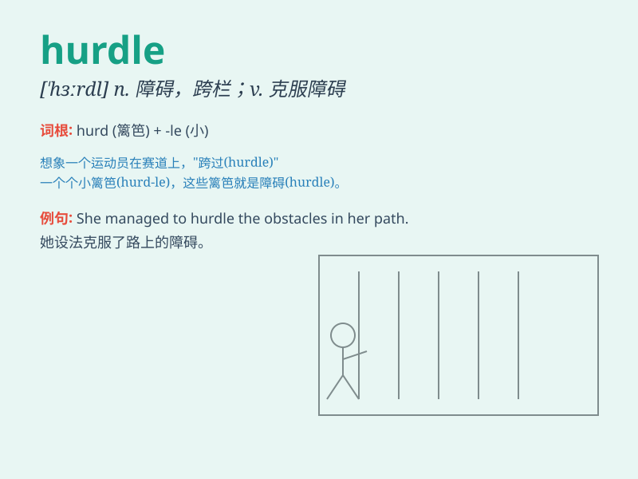

## hurdle

**英音:** _[\'hɜːd(ə)l]_ **美音:** _[\'hɝdl]_

**译义:**
*n.篱笆,栏,障碍,跨栏,活动篱笆v.用篱笆围住,跳过(栏栅),克服(障碍)*

### 短语

+ **clear a hurdle:** _越过障碍_

+ **jump hurdles:** _跨栏_

+ **hurdle race:** _跨栏比赛_

+ **overcome hurdles:** _克服障碍_

+ **face hurdles:** _面临障碍_

### 例句

#### 例句1

> **She cleared the hurdles easily in the track and field event.**

**中文翻译:** 她在田径比赛中轻松越过了跨栏。

**单词释义:** 跨栏；障碍

#### 例句2

> **Overcoming this hurdle will require a lot of effort.**

**中文翻译:** 克服这个障碍将需要很多努力。

**单词释义:** 障碍；困难

#### 例句3

> **The new project faced several hurdles before it could get
started.**

**中文翻译:** 这个新项目在启动之前面临了几个难题。

**单词释义:** 难题；障碍

### 背诵小故事

>
想象一下，一位运动员在赛道上面对一道道的栅栏（hurdle）。他必须鼓足勇气，跨越每一道障碍才能冲向终点。就像我们在生活中，要勇敢跨越困难的hurdle，不断前进。

**想象一位运动员面对一道道栅栏，就像我们在生活中面对困难。要勇敢跨越困难的'障碍、难关'，不断前进。**

### 图义

