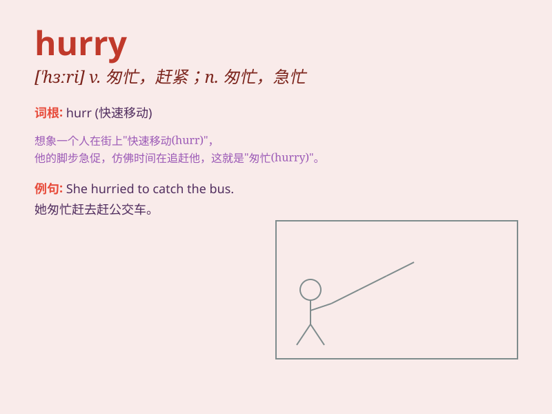

## hurry

**英音:** _[\'hʌrɪ]_ **美音:** _[\'hɝrɪ]_

**译义:** *v.(使)赶紧,(使)匆忙,加速n.匆忙,仓促*

### 短语

+ **in a hurry:** _匆忙；急于_

+ **hurry up:** _赶快；赶紧_

+ **hurry off:** _匆匆离去_

+ **hurry away:** _匆匆离开_

+ **in no hurry:** _不着急；不匆忙_

### 例句

#### 例句1

> **I\'m in a hurry to catch the train.**

**中文翻译:** 我急着赶火车。

**单词释义:** 匆忙；急忙

#### 例句2

> **She hurried home after work.**

**中文翻译:** 她下班后匆忙回家。

**单词释义:** 匆忙；赶快

#### 例句3

> **Hurry up! We\'ll be late.**

**中文翻译:** 快点！我们要迟到了。

**单词释义:** 催促；赶紧

### 背诵小故事

> One day, Tom was late for school. He had to hurry. He ran as fast as
he could, but his heart was beating fast. Finally, he made it just in
time. Hurry means to do something quickly!

**一天，汤姆上学要迟到了。他不得不赶快。他尽可能快地跑，但他的心跳得很快。最后，他刚好赶上。hurry
意思是快速做某事！**

### 图义

