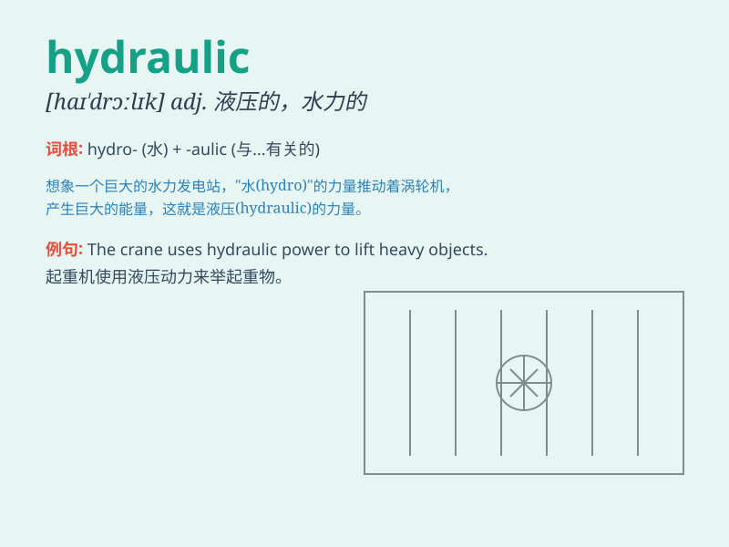

## hydraulic

**英音:** _[haɪ\'drɔːlɪk; haɪ\'drɒlɪk]_ **美音:**
_[haɪ\'drɔlɪk]_

**译义:** *adj.水力的,水压的*

### 短语

+ **hydraulic pressure:** _液压；水压_

+ **hydraulic system:** _液压系统_

+ **hydraulic engineering:** _水利工程_

+ **hydraulic cylinder:** _液压缸_

+ **hydraulic pump:** _液压泵_

### 例句

#### 例句1

> **The machine is driven by a hydraulic system.**

**中文翻译:** 这台机器由液压系统驱动。

**单词释义:** 液压的

#### 例句2

> **Hydraulic pressure is used to lift the heavy load.**

**中文翻译:** 液压被用于吊起重物。

**单词释义:** 液压

#### 例句3

> **The construction workers are operating the hydraulic crane.**

**中文翻译:** 建筑工人正在操作液压起重机。

**单词释义:** 液压的

### 背诵小故事

>
想象一下，在一个大型工厂里，有一种神奇的力量能轻松推动巨大的机械，就像水的力量一样强大。这种力量就叫
hydraulic，它就像水一样流畅且有力，专门用于描述与水或液体有关的强大动力。

**想象在工厂中有一种像水一样强大的力量推动机械，此力量叫
hydraulic，用于描述与水或液体有关的强大动力。**

### 图义

