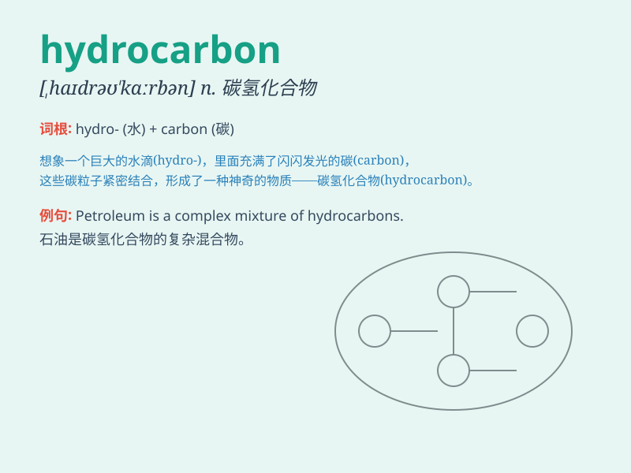

## hydrocarbon

**英音:** _[,haɪdrə(ʊ)\'kɑːb(ə)n]_ **美音:**
_[,haɪdrə\'kɑrbən]_

**译义:** *n.烃,碳氢化合物*

### 短语

+ **hydrocarbon compound:** _碳氢化合物_

+ **hydrocarbon emissions:** _碳氢化合物排放_

+ **hydrocarbon fuel:** _碳氢燃料_

+ **hydrocarbon reservoir:** _油气藏_

+ **hydrocarbon molecule:** _碳氢分子_

### 例句

#### 例句1

> **Natural gas is mainly composed of hydrocarbons.**

**中文翻译:** 天然气主要由碳氢化合物组成。

**单词释义:** 碳氢化合物

#### 例句2

> **The chemist is studying the properties of various
hydrocarbons.**

**中文翻译:** 这位化学家正在研究各种碳氢化合物的性质。

**单词释义:** 碳氢化合物

#### 例句3

> **Hydrocarbons are the main source of energy in modern society.**

**中文翻译:** 碳氢化合物是现代社会的主要能源来源。

**单词释义:** 碳氢化合物

### 背诵小故事

> Imagine a group of scientists exploring a mysterious cave. They
discover a strange liquid that is a combination of hydrogen and carbon.
They call it \'hydrocarbon\', which is like a hidden treasure in the
cave.

**想象一群科学家探索一个神秘的洞穴。他们发现了一种由氢和碳组成的奇怪液体。他们称之为"碳氢化合物"，它就像洞穴里隐藏的宝藏。**

### 图义

