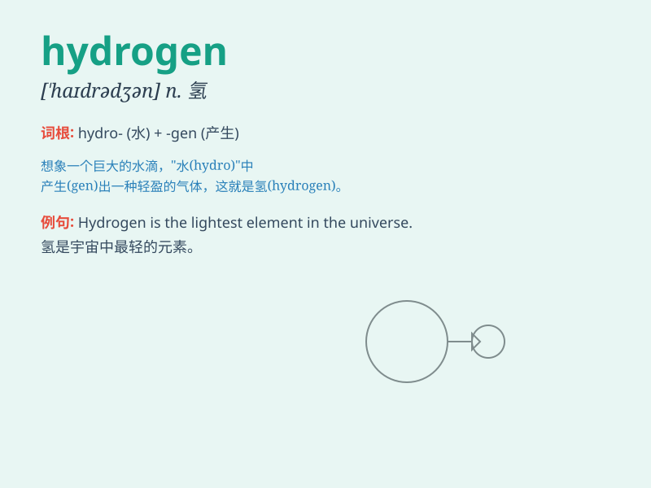

## hydrogen

**英音:** _[\'haɪdrədʒ(ə)n]_ **美音:** _[\'haɪdrədʒən]_

**译义:** *n.氢*

### 短语

+ **hydrogen bond:** _氢键_

+ **hydrogen peroxide:** _过氧化氢；双氧水_

+ **hydrogen sulfide:** _硫化氢_

+ **hydrogen fuel cell:** _氢燃料电池_

+ **hydrogen economy:** _氢经济_

### 例句

#### 例句1

> **Hydrogen is the lightest element in the periodic table.**

**中文翻译:** 氢是元素周期表中最轻的元素。

**单词释义:** 氢（一种化学元素）

#### 例句2

> **Water is composed of hydrogen and oxygen.**

**中文翻译:** 水由氢和氧组成。

**单词释义:** 氢（组成物质的成分）

#### 例句3

> **Hydrogen is used as a fuel in some advanced technologies.**

**中文翻译:** 在一些先进技术中，氢被用作燃料。

**单词释义:** 氢（作为燃料的物质）

### 背诵小故事

> In a faraway laboratory, a scientist was working hard. One day, he
discovered a special gas that was very light and could make things
float. He called it \'hydrogen\', meaning the gas that brings new
possibilities and lightness.

**在一个遥远的实验室里，一位科学家正在努力工作。有一天，他发现了一种特殊的气体，非常轻，可以让东西漂浮起来。他称之为"氢"，意思是带来新的可能性和轻盈的气体。**

### 图义

