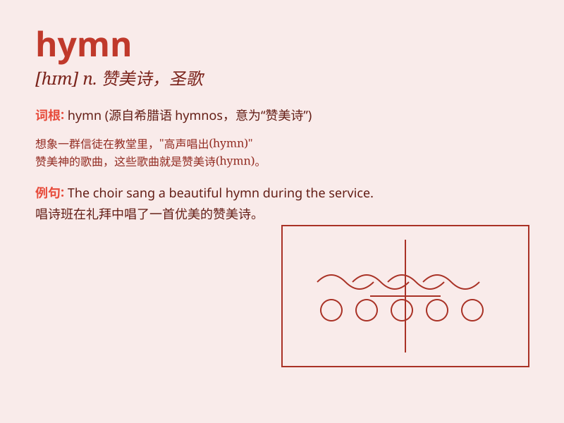

## hymn

**英音:** _[hɪm]_ **美音:** _[hɪm]_

**译义:** *n.赞美诗,圣歌v.唱赞美歌*

### 短语

+ **hymn book:** _赞美诗集_

+ **hymn sheet:** _赞美诗单页_

+ **sing a hymn:** _唱赞美诗_

+ **church hymn:** _教堂赞美诗_

+ **hymn of praise:** _赞美之歌_

### 例句

#### 例句1

> **The choir sang a beautiful hymn during the church service.**

**中文翻译:** 教堂礼拜期间，唱诗班唱起了优美的赞美诗。

**单词释义:** 赞美诗

#### 例句2

> **She hummed a hymn as she worked in the garden.**

**中文翻译:** 她在花园里干活时哼着赞美诗。

**单词释义:** 赞美诗

#### 例句3

> **The old man\'s heart was filled with joy as he listened to the
familiar hymn.**

**中文翻译:** 听着熟悉的圣歌，老人的心里充满了喜悦。

**单词释义:** 赞美诗

### 背诵小故事

> A group of friends went on a hike. When they reached the top of the
mountain, they sang a beautiful hymn together to express their joy and
gratitude. The hymn\'s melody echoed through the valley.

**一群朋友去远足。当他们到达山顶时，一起唱了一首优美的赞美诗来表达他们的喜悦和感激之情。赞美诗的旋律在山谷中回荡。**

### 图义

